# Airbnb订房地点预测

便签：SVM、随机森林、XGBoost的对比

[TOC]

## 1、背景和目标

背景：在Airbnb上用户可以预定涵盖34,000+ 城市的酒店进行居住。通过精准预测用户的首次预定地点，可以为用户提供更多个人推荐信息，提升用户的预定体验和提高平台的知名度。

目标：根据所提供的数据建立ML模型，预测用户的首次订房地点

## 2、分析方法

分别使用SVM、随机森林、GBDT的机器学习模型进行建模，对比三种模型的效果，选出相对优的模型

## 3、Data_Exploring


```python
import numpy as np
import pandas as pd
import matplotlib.pyplot as plt
plt.style.use('ggplot')
import sklearn as sk
%matplotlib inline
import datetime
import os
import seaborn as sns
```


```python
train = pd.read_csv("train_users_2.csv")
test = pd.read_csv("test_users.csv")
```


```python
sessions = pd.read_csv('sessions.csv')
countries = pd.read_csv('countries.csv')
age_gender_bkts = pd.read_csv('age_gender_bkts.csv')
```


```python
print(train.info(),'\n',test.info())
```

    <class 'pandas.core.frame.DataFrame'>
    RangeIndex: 213451 entries, 0 to 213450
    Data columns (total 16 columns):
    id                         213451 non-null object
    date_account_created       213451 non-null object
    timestamp_first_active     213451 non-null int64
    date_first_booking         88908 non-null object
    gender                     213451 non-null object
    age                        125461 non-null float64
    signup_method              213451 non-null object
    signup_flow                213451 non-null int64
    language                   213451 non-null object
    affiliate_channel          213451 non-null object
    affiliate_provider         213451 non-null object
    first_affiliate_tracked    207386 non-null object
    signup_app                 213451 non-null object
    first_device_type          213451 non-null object
    first_browser              213451 non-null object
    country_destination        213451 non-null object
    dtypes: float64(1), int64(2), object(13)
    memory usage: 26.1+ MB
    <class 'pandas.core.frame.DataFrame'>
    RangeIndex: 62096 entries, 0 to 62095
    Data columns (total 15 columns):
    id                         62096 non-null object
    date_account_created       62096 non-null object
    timestamp_first_active     62096 non-null int64
    date_first_booking         0 non-null float64
    gender                     62096 non-null object
    age                        33220 non-null float64
    signup_method              62096 non-null object
    signup_flow                62096 non-null int64
    language                   62096 non-null object
    affiliate_channel          62096 non-null object
    affiliate_provider         62096 non-null object
    first_affiliate_tracked    62076 non-null object
    signup_app                 62096 non-null object
    first_device_type          62096 non-null object
    first_browser              62096 non-null object
    dtypes: float64(2), int64(2), object(11)
    memory usage: 7.1+ MB
    None 
     None

* 查看train数据集合test数据集的缺失值个数

```python
print(train.shape,test.shape)
print(train.isnull().sum(),'\n',test.isnull().sum())
```

* 查看各特征值的取值情况

```python
cols = []
num = []
missing_col = []
cat_col = []
cont_col = []

for col in train.columns:
    cols.append(col)
    num.append(len(train[col].unique()))
    if train[col].isnull().sum():
        missing_col.append(col)
    if len(train[col].unique()) < 128:
        cat_col.append(col)
    if len(train[col].unique()) >= 128:
        cont_col.append(col)

cat_col.remove('country_destination')   
cont_col.remove('id')

for i, j in sorted(zip(cols, num), key = lambda x: x[1], reverse = True):
    print('The value_counts of %s is %d'%(i, j))
```

    The value_counts of id is 213451
    The value_counts of timestamp_first_active is 213451
    The value_counts of date_first_booking is 1977
    The value_counts of date_account_created is 1634
    The value_counts of age is 128
    The value_counts of first_browser is 52
    The value_counts of language is 25
    The value_counts of affiliate_provider is 18
    The value_counts of signup_flow is 17
    The value_counts of country_destination is 12
    The value_counts of first_device_type is 9
    The value_counts of affiliate_channel is 8
    The value_counts of first_affiliate_tracked is 8
    The value_counts of gender is 4
    The value_counts of signup_app is 4
    The value_counts of signup_method is 3

* 查看缺失值分布情况

```python
import missingno as msno

msno.matrix(train[missing_col])
```

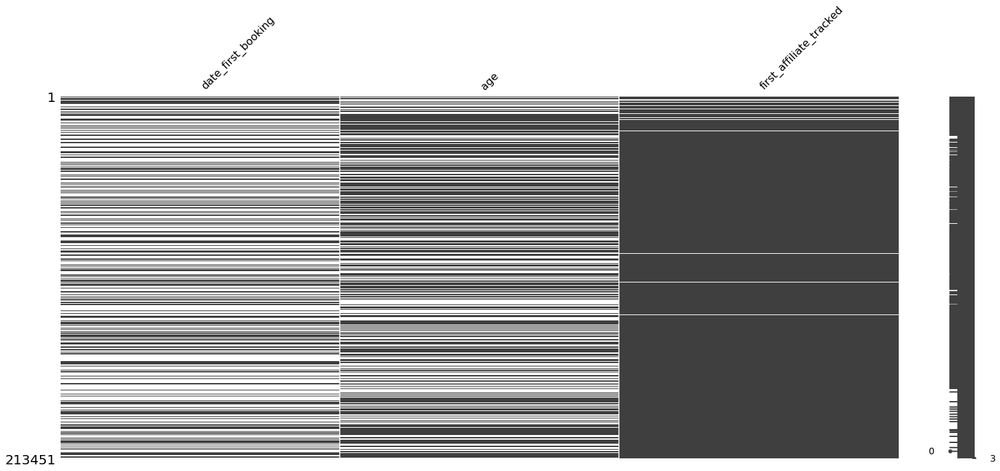

* 计算出带缺失值的变量间的相关关系

```python
msno.heatmap(train[missing_col])
```


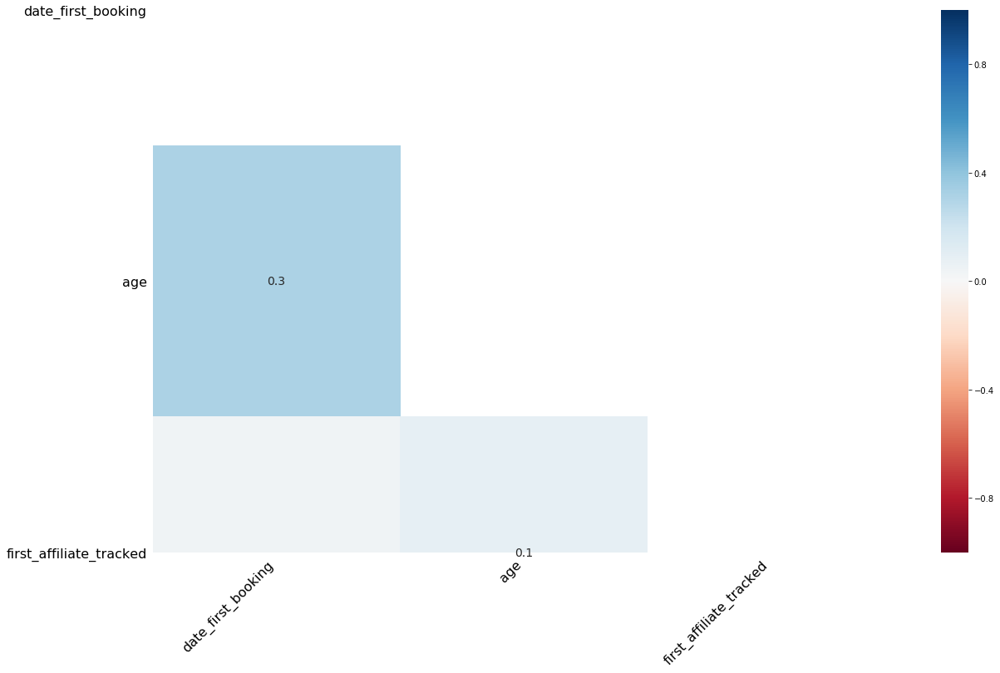

### 3.1、date_account_created


```python
dac_train=train.date_account_created.value_counts()
dac_test=test.date_account_created.value_counts()
print(dac_train,dac_test)
print('train.date_account_created:',
      dac_train.describe(),
      'test.date_account_created:\n',
      dac_test.describe())
```


```python
dac_train_data=pd.to_datetime(dac_train.index)
dac_test_data=pd.to_datetime(dac_test.index)

dac_train_day=dac_train_data-dac_train_data.min()
dac_test_day=dac_test_data-dac_train_data.min()

print(dac_train_day,'\n',dac_test_day)
```

* 查看date_account_created的分布情况


```python
plt.scatter(dac_train_day.days,dac_train.values,color='r',label='train_datasets')
plt.scatter(dac_test_day.days,dac_test.values,color='b',label='test_datasets')
plt.xlabel("Days")
plt.ylabel("The number of accounts created")
plt.title('Accounts created vs day'
```


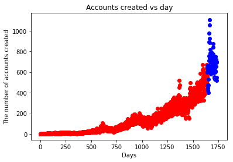

### 3.2、timestamp_first_active

* 将object数据类型转换为时间数据类型，方便后续建模分析


```python
tfa_train=train.timestamp_first_active
tfa_train=train.timestamp_first_active.map(lambda x: datetime.datetime.strptime(str(x),'%Y%m%d%H%M%S'))
tfa_train.head()
```

### 3.3、age

* 将年龄数据分段并可视化


```python
age_train=[train.age.isnull().sum(),
           train.query('age<15').age.shape[0],
           train.query('age>=15&age<90').age.shape[0],
           train.query('age>=90').age.shape[0]]
age_test=[test.age.isnull().sum(),
          test.query('age<15').age.shape[0],
          test.query('age>=15&age<90').age.shape[0],
          test.query('age>=90').age.shape[0]]

columns=['Null','age<15','15<=age<90','age>90']

fig,(ax1,ax2)=plt.subplots(1,2,sharex=True,sharey=True,figsize=(10,5))
sns.barplot(columns,age_train,ax=ax1)
sns.barplot(columns,age_test,ax=ax2)
ax1.set_title('train datasets')
ax2.set_title('test datasets')
ax1.set_ylabel('counts')
```


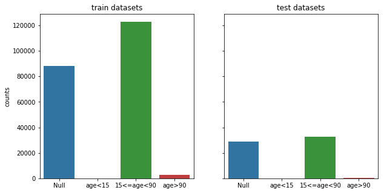

### 3.4、Categorical features

* 将分类数据的分布情况可视化


```python
cate_feats = ['gender', 
             'signup_method', 
             'signup_flow', 
             'language', 
             'affiliate_channel', 
             'affiliate_provider', 
             'first_affiliate_tracked', 
             'signup_app', 
             'first_device_type', 
             'first_browser']

def feature_barplot(feature, df_train = train, df_test = test, figsize=(10,5), rot = 90, saveimg = False):
    
    feat_train = df_train[feature].value_counts()
    feat_test = df_test[feature].value_counts()
    
    fig_feature, (ax1,ax2) = plt.subplots(1,2,sharex=True, sharey = True, figsize = figsize)

    sns.barplot(feat_train.index.values, feat_train.values, ax = ax1)
    sns.barplot(feat_test.index.values, feat_test.values, ax = ax2)
    
    ax1.set_xticklabels(ax1.xaxis.get_majorticklabels(), rotation = rot)
    ax2.set_xticklabels(ax1.xaxis.get_majorticklabels(), rotation = rot)

    ax1.set_title(feature + ' of train dataset')
    ax2.set_title(feature + ' of test dataset')
    ax1.set_ylabel('counts')
    
    plt.tight_layout()
    
for feat in cate_feats:
    feature_barplot(feature = feat)
```


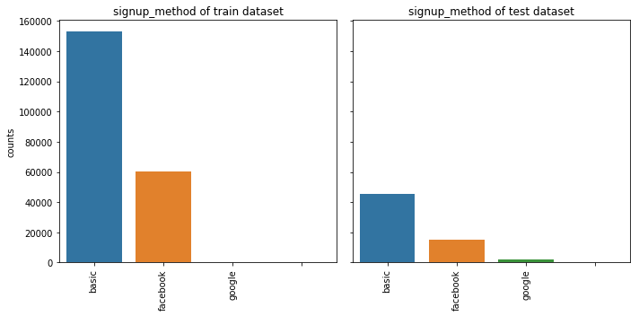


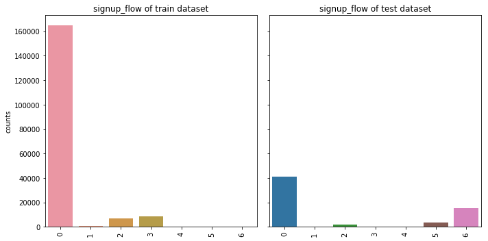


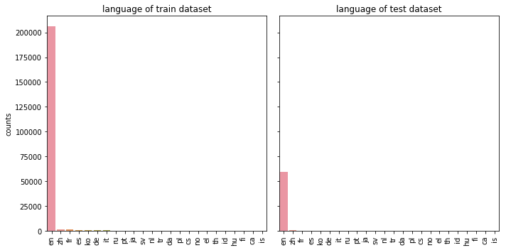


## 4、 Feature_Enginnering


```python
import numpy as np
import pandas as pd
import matplotlib.pyplot as plt
import sklearn as sk
#import pickle
import datetime
from datetime import date
#import os
import seaborn as sns
from sklearn.preprocessing import *
from sklearn.preprocessing import LabelEncoder
from sklearn.model_selection import StratifiedShuffleSplit
import seaborn as sns
%matplotlib inline
```

### 4.1、session数据集

```python
df_session['id']=df_session['user_id']
df_session.drop(['user_id'],axis=1).head()
```


```python
df_session.isnull().sum()
```


    user_id            2797
    action             7873
    action_type      143097
    action_detail    143097
    device_type           0
    secs_elapsed      11067
    id                 2797
    dtype: int64

* 填补缺失值为 NAN


```python
df_session.action=df_session.action.fillna('NAN')
df_session.action_type=df_session.action_type.fillna('NAN')
df_session.action_detail=df_session.action_detail.fillna('NAN')
df_session.device_type=df_session.device_type.fillna('NAN')
```

* 构建新特征


```python
act=dict(zip(*np.unique(df_session.action,return_counts=True)))
df_session.action=df_session.action.apply(lambda x: 'OTHER' if act[x]<100 else x)##apply函数是对每一列进行函数操作，map是对每个元素进行函数操作
f_act=df_session.action.value_counts().argsort()
f_act_detail = df_session.action_detail.value_counts().argsort()
f_act_type = df_session.action_type.value_counts().argsort()
f_dev_type = df_session.device_type.value_counts().argsort()

samples=[]
cont=0
ln=len(dgr_session)

for g in dgr_session:
    if cont%10000==0:
        print('%s from %s'%(cont,ln))
    gr=g[1]
    l=[]
    l.append(g[0])
    l.append(len(gr))
    sev=gr.secs_elapsed.fillna(0).values
    
    c_act=[0]*len(f_act)
    for i,v in enumerate(gr.action.values):
        c_act[f_act[v]]+=1
    _,c_act_uqc=np.unique(gr.action.values,return_counts=True)
    c_act+=[len(c_act_uqc),np.mean(c_act_uqc),np.std(c_act_uqc)]
    l=l+c_act
    
    c_act_detail = [0] * len(f_act_detail)
    for i,v in enumerate(gr.action_detail.values):
        c_act_detail[f_act_detail[v]] += 1 
    _, c_act_det_uqc = np.unique(gr.action_detail.values, return_counts=True)
    c_act_detail += [len(c_act_det_uqc), np.mean(c_act_det_uqc), np.std(c_act_det_uqc)]
    l=l+c_act_detail
    
    c_act_type=[0]*len(f_act_type)
    l_act_type=[0]*len(f_act_type)
    for i,v in enumerate(gr.action_type.values):
        c_act_type[f_act_type[v]]+=1
        l_act_type[f_act_type[v]]+=sev[i]
    l_act_type=np.log(1+np.array(l_act_type)).tolist()
    _, c_act_type_uqc = np.unique(gr.action_type.values, return_counts=True)
    c_act_type += [len(c_act_type_uqc), np.mean(c_act_type_uqc), np.std(c_act_type_uqc)]
    l=l+c_act_type+l_act_type
    
    c_dev_type=[0]*len(f_dev_type)
    for i,v in enumerate(gr.device_type.values):
        c_dev_type[f_dev_type[v]]+=1
    _, c_dev_type_uqc=np.unique(gr.device_type.values,return_counts=True)
    c_dev_type+=[len(c_dev_type_uqc),np.mean(c_dev_type_uqc),np.std(c_dev_type_uqc)]
    l=l+c_dev_type
    
    l_secs=[0]*5
    l_log=[0]*15
    if len(sev)>0:
        l_secs[0]=np.log(1+np.sum(sev))
        l_secs[1]=np.log(1+np.mean(sev))
        l_secs[2]=np.log(1+np.std(sev))
        l_secs[3]=np.log(1+np.median(sev))
        l_secs[4]=l_secs[0]/float(l[1])
    
        log_sev=np.log(1+sev).astype(int)
        l_log=np.bincount(log_sev,minlength=15).tolist()
    l=l+l_secs+l_log
    
    samples.append(l)
    cont+=1
```

* 构造用户数据矩阵

```python
samples=np.array(samples)
samp_ar=samples[:,1:].astype(np.float16)##将数据改为浮点型
samp_id=samples[:,0]

col_names=[]
for i in range(len(samples[0])-1):
    col_names.append('c_'+str(i))
df_agg_sess=pd.DataFrame(samp_ar,columns=col_names)
df_agg_sess['id']=samp_id
df_agg_sess.index=df_agg_sess.id
```

### 4.2、train和test数据集


```python
train=pd.read_csv('train_users_2.csv')
test=pd.read_csv('test_users.csv')

labels=train.country_destination.values
id_test=test['id'].values

train.drop(['country_destination','date_first_booking'],axis=1,inplace=True)
test.drop(['date_first_booking'],axis=1,inplace=True)
df=pd.concat([train,test],axis=0,ignore_index=True)
```

#### 4.2.1、timestamp_first_active


```python
tfa=df.timestamp_first_active.apply(
    lambda x : datetime.datetime.strptime( str(x) ,'%Y%m%d%H%M%S'))
df['tfa_year']=np.array([x.year for x in tfa])
df['tfa_month']=np.array([x.month for x in tfa])
df['tfa_day']=np.array([x.day for x in tfa])
```

* 构建星期数据


```python
df['tfa_wd']=np.array([x.isoweekday() for x in tfa])
df_tfa_wd=pd.get_dummies(df.tfa_wd,prefix='tfa_wd')
df=pd.concat([df,df_tfa_wd],axis=1)
df.drop('tfa_wd',axis=1,inplace=True)
```

* 构建季节数据


```python

Y=2016
seasons={(date(Y,1,1),date(Y,3,20)):0,
        (date(Y,3,21),date(Y,6,20)):1,
        (date(Y,6,21),date(Y,9,20)):2,
        (date(Y,9,21),date(Y,12,20)):3,
        (date(Y,12,21),date(Y,12,31)):0}
tfa_year=tfa.apply(lambda x : x.date().replace(year=Y))
tfa_season=tfa_year.map(
    lambda x : next(
        values for (key1,key2),values in seasons.items() if key1<= x <=key2))##不用next函数会导致无法迭代
df['tfa_season']=tfa_season
df_tfa_season=pd.get_dummies(df.tfa_season,prefix='tfa_season')
df=pd.concat([df,df_tfa_season],axis=1)
df.drop('tfa_season',axis=1,inplace=True)
```


#### 4.2.2、date_account_created


```python
Y=2016
seasons={(date(Y,1,1),date(Y,3,20)):0,
        (date(Y,3,21),date(Y,6,20)):1,
        (date(Y,6,21),date(Y,9,20)):2,
        (date(Y,9,21),date(Y,12,20)):3,
        (date(Y,12,21),date(Y,12,31)):0}
```


```python
dac=pd.to_datetime(df.date_account_created)
dac_year=dac.apply(lambda x: x.date().replace(year=Y))
dac_season=dac_year.apply(lambda x : next(values for (key1,key2),values in seasons.items() if key1<=x<=key2))
```


```python
df['dac_year']=np.array([x.year for x in dac])
df['dac_month']=np.array([x.month for x in dac])
df['dac_day']=np.array([x.day for x in dac])
df['dac_wd']=np.array([x.isoweekday() for x in dac])
df_dac_wd=pd.get_dummies(df.dac_wd,prefix='dac_wd')
df.drop('dac_wd',axis=1,inplace=True)
```


```python
df['dac_season']=dac_season
df_dac_season=pd.get_dummies(df.dac_season,prefix='dac_season')
df.drop('dac_season',axis=1,inplace=True)
```


```python
df=pd.concat([df,df_dac_wd,df_dac_season],axis=1)
```


#### 4.2.3、time span between dac and tfa


```python
print(dac.dtype,tfa.dtype)
dt_span = dac.subtract(tfa).dt.days
dt_span.head()
```

    0    465
    1    731
    2    475
    3    764
    4    279
    dtype: int64


```python
plt.scatter(dt_span.value_counts().index.values,dt_span.value_counts().values)
```


* 将df_span进行分段

```python
def get_span(dt):
    if dt==-1:
        return 'OneDay'
    elif -1<dt<=31:
        return 'OneMonth'
    elif 31<dt<365:
        return 'OneYear'
    else:
        return 'Other'

df['span']=np.array([get_span(i) for i in dt_span])
df_span=pd.get_dummies(df.span,prefix='span')
df=pd.concat([df,df_span],axis=1)
df.drop('span',axis=1,inplace=True)
df.drop(['date_account_created','timestamp_first_active'],axis=1,inplace=True)
```

#### 4.2.4、age


```python
av=df.age
age_values=av.apply(lambda x: np.where(x>1900,2019-x,x))
age_values=age_values.apply(lambda x: np.where(x>=132,-1,x))

age_values.fillna(-1,inplace=True)

def get_age(age):
    if age<0:
        return 'NA'
    elif 0<age<=18:
        return 'Juvenile'
    elif 18<age<=40:
        return 'Youth'
    elif 40<age<=66:
        return 'Middlescent'
    else:
        return 'Senium'

age_type=age_values.apply(lambda x : get_age(x))

df['age_type']=age_type
age_types=pd.get_dummies(df.age_type,prefix='age_type')
df=pd.concat([df,age_types],axis=1)
df.drop(['age','age_type'],axis=1,inplace=True)
```

#### 4.2.5、categorical features


```python
feat_toOHE = ['gender', 
             'signup_method', 
             'signup_flow', 
             'language', 
             'affiliate_channel', 
             'affiliate_provider', 
             'first_affiliate_tracked', 
             'signup_app', 
             'first_device_type', 
             'first_browser']
for i in feat_toOHE:
    df_toOHE=pd.get_dummies(df[i],prefix=i,dummy_na=True)
    df=pd.concat((df,df_toOHE),axis=1)
    df.drop(i,axis=1,inplace=True)
```

#### 4.2.6、merge with session

----


```python
### ps： 用法举例
from pandas import Series,DataFrame,merge
import numpy as np
data=DataFrame([{"id":0,"name":'lxh',"age":20,"cp":'lm'},{"id":1,"name":'xiao',"age":40,"cp":'ly'},{"id":2,"name":'hua',"age":4,"cp":'yry'},{"id":3,"name":'be',"age":70,"cp":'old'}])
data1=DataFrame([{"id":100,"name":'lxh','cs':10},{"id":101,"name":'xiao','cs':40},{"id":102,"name":'hua2','cs':50}])
data2=DataFrame([{"id":0,"name":'lxh','cs':10},{"id":101,"name":'xiao','cs':40},{"id":102,"name":'hua2','cs':50}])

print(data)
print(data1)
print(data2)

print('左外连接\r\n',merge(data,data1,on="name",how="left",suffixes=('_a','_b')))
print('左外连接1\r\n',merge(data1,data,on="name",how="left"))
print('右外连接\r\n',merge(data,data1,on="name",how="right"))
data3=DataFrame([{"mid":0,"mname":'lxh','cs':10},{"mid":101,"mname":'xiao','cs':40},{"mid":102,"mname":'hua2','cs':50}])

#当左右两个DataFrame的列名不同，当又想做为连接键时可以使用left_on与right_on来指定连接键
print("使用left_on与right_on来指定列名字不同的连接键\r\n",merge(data,data3,left_on=["name","id"],right_on=["mname","mid"]))
```

---


```python
df_all=pd.merge(df,df_agg_sess,on='id',how='left')
df_all.fillna(-2,inplace=True)
df_all.drop('id',axis=1,inplace=True)
```

#### 4.2.7、split train and test datasets


```python
Xtrain=df_all.iloc[:train_row,:]
Xtest=df_all.iloc[train_row:,:]

le=LabelEncoder()
le.fit(labels)
ytrain=le.transform(labels)

Xtrain.to_csv('Airbnb_xtrain.csv')
Xtest.to_csv('Airbnb_xtest.csv')
```


```python
labels.tofile('Airbnb_ytrain.csv',sep='\n',format='%s')
```

## 5、Modeling


```python
import numpy as np
import pandas as pd
import matplotlib.pyplot as plt
%matplotlib inline
import seaborn as sns
import pickle
import datetime
import sklearn as sk
from sklearn.preprocessing import StandardScaler
from sklearn.preprocessing import LabelBinarizer
```


```python
xtrain=pd.read_csv('Airbnb_xtrain.csv',index_col=False)
xtest=pd.read_csv('Airbnb_xtest.csv',index_col=False)
## index_col=False可以保证读取数据时不会使用第一列做index，因为默认读取时会使用第一列做index
```


```python
from sklearn.preprocessing import LabelEncoder
le=LabelEncoder()
le.fit(ytrain.values.ravel())
ytrain_le=le.transform(ytrain.values.ravel())
##在对一列数据做LabelEncoder时，会导致出现warning，使用ravel（）可以规范使用！！！
```


```python
n=int(xtrain.shape[0]*0.01)
print(n)
xtrain_new=xtrain.iloc[:n,:]
ytrain_le_new=ytrain_le[:n]
## ndarry没有iloc函数
print(xtrain_new.shape)
print(ytrain_le_new.shape)
```

    2134
    (2134, 493)
    (2134,)


```python
X_Scaler=StandardScaler()
xtrain_new_stdsca=X_Scaler.fit_transform(xtrain_new.astype('float64'))
##若不使用astype('float64'),会产生warning，因为传入的是int类型数据
```

### 5.1、Airbnb Evaluation: NDCG


```python
from sklearn.metrics import make_scorer
from sklearn.preprocessing import LabelBinarizer

def dcg_score(y_true,y_score,k=5):
    '''
    y_true: array,shape= [n_samples]
        true relevance labels
    y_score: array,shape= [n_samples]
        predicted scores
    k: int
    '''
    order=np.argsort(y_score)[::-1]
    y_true=np.take(y_true,order[:k])
    
    gain=2**y_true - 1
    discounts=np.log2(np.arange(len(y_true))+2)
    return np.sum(gain/discounts)

def ndcg(ground_truth,predictions,k=5):
    lb=LabelBinarizer()
    lb.fit(range(len(np.unique(ytrain_le_new))+1))
    T=lb.transform(ground_truth)
    
    scores=[]
    
    for y_true,y_score in zip(T,predictions):
        actual=dcg_score(y_true,y_score,k)
        best=dcg_score(y_true,y_true,k)
        score=float(actual)/float(best)
        scores.append(score)
        
    return np.mean(scores)
```

### 5.2、logistic regression

#### 5.2.1、模型拟合


```python
from sklearn.linear_model import LogisticRegression as lg

lr=lg(C=1.0,penalty='l2',solver='newton-cg',multi_class='multinomial')
## 1、solver=‘newton_cg’可以指定优化方法（例子中指定为牛顿法），不指定时会有warning出现
## 2、multi_class='multinomial'可以指定分类方法（例子中指定为多分类），不指定时会有warning出现
```


```python
from sklearn.model_selection import KFold, train_test_split, cross_val_score

randomstate=2019

kf=KFold(n_splits=5,random_state=randomstate)

train_logs_score=[]
cv_logs_score=[]

k_ndcg=5

for train_index,test_index in kf.split(xtrain_new_stdsca,ytrain_le_new):
    x_train,x_test=xtrain_new_stdsca[train_index,:],xtrain_new_stdsca[test_index,:]
    y_train,y_test=ytrain_le_new[train_index],ytrain_le_new[test_index]
    
    print(x_train.shape,x_test.shape)
    
    lr.fit(x_train,y_train)
    y_pred=lr.predict_proba(x_test)
    
    train_ndcg_score=ndcg(y_train,lr.predict_proba(x_train),k=k_ndcg)
    test_ndcg_score=ndcg(y_test,y_pred,k=k_ndcg)
    
    train_logs_score.append(train_ndcg_score)
    cv_logs_score.append(cv_ndcg_score)
    
print('Training ndcg scoring is ',np.mean(train_logs_score))
print('Testing ndcg scoring is ',np.mean(cv_logs_score))
```

    (1707, 493) (427, 493)
    (1707, 493) (427, 493)
    (1707, 493) (427, 493)
    (1707, 493) (427, 493)
    (1708, 493) (426, 493)
    Training ndcg scoring is  0.7561098398521395
    Testing ndcg scoring is  0.6309297535714575

#### 5.2.2、迭代次数对比


```python
from sklearn.linear_model import LogisticRegression as lg

iteration=[1,20,30,40,50,100]

train_score=[]
cv_score=[]

kf=KFold(n_splits=5,random_state=2017)

k_ndcg=11

for max_iter in iteration:
    lr=lg(solver='newton-cg',multi_class='multinomial',max_iter=max_iter)
    
    train_iter_score=[]
    cv_iter_score=[]
    
    print('The max_iter is %s'%(max_iter))
    
    for train_index,test_index in kf.split(xtrain_new_stdsca,ytrain_le_new):
        x_train,x_test=xtrain_new_stdsca[train_index,:],xtrain_new_stdsca[test_index,:]
        y_train,y_test=ytrain_le_new[train_index],ytrain_le_new[test_index]

        lr.fit(x_train,y_train)
        y_pred=lr.predict_proba(x_test)
    
        train_ndcg_score=ndcg(y_train,lr.predict_proba(x_train),k=k_ndcg)
        cv_ndcg_score=ndcg(y_test,y_pred,k=k_ndcg)
    
        train_iter_score.append(train_ndcg_score)
        cv_iter_score.append(cv_ndcg_score)
    
    train_score.append(np.mean(train_iter_score))
    cv_score.append(np.mean(cv_iter_score))
    print('Training ndcg scoring is ',np.mean(train_iter_score))
    print('Testing ndcg scoring is ',np.mean(cv_iter_score),'.\n')
    ##加上\n可以换行，方便查看
```

    The max_iter is 1


    Training ndcg scoring is  0.757425485443312
    Testing ndcg scoring is  0.5342151580451073 .
    
    The max_iter is 20


    Training ndcg scoring is  0.7744951619561935
    Testing ndcg scoring is  0.7187228553405969 .
    
    The max_iter is 30
    Training ndcg scoring is  0.7744951619561935
    Testing ndcg scoring is  0.7187228553405969 .
    
    The max_iter is 40
    Training ndcg scoring is  0.7744951619561935
    Testing ndcg scoring is  0.7187228553405969 .
    
    The max_iter is 50
    Training ndcg scoring is  0.7744951619561935
    Testing ndcg scoring is  0.7187228553405969 .
    
    The max_iter is 100
    Training ndcg scoring is  0.7744951619561935
    Testing ndcg scoring is  0.7187228553405969 .


​    


```python
ymin=np.min(cv_score)-0.05
ymax=1

plt.plot(iteration,train_score,'ro-',label='training')
plt.plot(iteration,cv_score,'b*-',label='cross-validation')
plt.ylabel('Score')
plt.xlabel('iterations')
plt.plot(np.linspace(20,20,50),np.linspace(ymin,ymax,50),'g--')
plt.xlim(-5,np.max(iteration)+5)
plt.ylim(ymin,ymax)
plt.legend(loc='lower right',fontsize=12)
plt.title('Learning Curve')
for a,b in zip(iteration,train_score):
    plt.text(a, b+0.025, '%.1f'%(b), ha='center', va= 'bottom',fontsize=12)
for a,b in zip(iteration,cv_score):
    plt.text(a,b+0.025,'%.1f'%(b),ha='center',va='bottom',fontsize=12)
##  ha='center', va= 'bottom'代表 horizontalalignment（水平对齐）、verticalalignment（垂直对齐）的方式
plt.tight_layout()
```


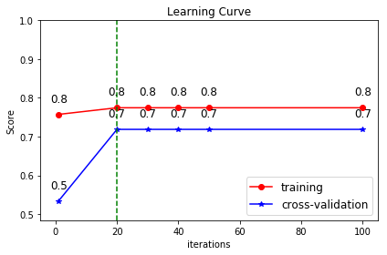

### 5.3、Tree method

#### 5.3.1、随机森林模型不同数量分类器效果对比


```python
##learning_rate=0.1只用于boost方法
max_depth=9
random_state=2019
num_estimators=100+np.arange(0,1000,100)

from sklearn.ensemble import RandomForestClassifier as RF
from sklearn.model_selection import KFold

kf=KFold(n_splits=5,random_state=random_state)

train_score=[]
cv_score=[]

k_ndcg=11

for n_estimators in num_estimators:
    clf=RF(max_depth=max_depth,n_estimators=n_estimators,random_state=random_state)
    print(clf)
    
    train_nes_score=[]
    cv_nes_score=[]
    
    for train_index,test_index in kf.split(xtrain_new_stdsca,ytrain_le_new):
        x_train,x_test=xtrain_new_stdsca[train_index,:],xtrain_new_stdsca[test_index,:]
        y_train,y_test=ytrain_le_new[train_index],ytrain_le_new[test_index]
    
        clf.fit(x_train,y_train)
        y_pred=clf.predict_proba(x_test)
        
        train_ndcg_score=ndcg(y_train,clf.predict_proba(x_train),k=k_ndcg)
        cv_ndcg_score=ndcg(y_test,y_pred,k=k_ndcg)
        
        train_nes_score.append(train_ndcg_score)
        cv_nes_score.append(cv_ndcg_score)
        
    train_score.append(np.mean(train_nes_score))
    cv_score.append(np.mean(cv_nes_score))
    
    print('Training_score is %s.'%(np.mean(train_score)))
    print('Cv_score is %s.\n'%(np.mean(cv_score)))
```

    RandomForestClassifier(bootstrap=True, class_weight=None, criterion='gini',
                max_depth=9, max_features='auto', max_leaf_nodes=None,
                min_impurity_decrease=0.0, min_impurity_split=None,
                min_samples_leaf=1, min_samples_split=2,
                min_weight_fraction_leaf=0.0, n_estimators=100, n_jobs=None,
                oob_score=False, random_state=2019, verbose=0,
                warm_start=False)
    Training_score is 0.839325263002572.
    Cv_score is 0.755664487733428.
    
    RandomForestClassifier(bootstrap=True, class_weight=None, criterion='gini',
                max_depth=9, max_features='auto', max_leaf_nodes=None,
                min_impurity_decrease=0.0, min_impurity_split=None,
                min_samples_leaf=1, min_samples_split=2,
                min_weight_fraction_leaf=0.0, n_estimators=200, n_jobs=None,
                oob_score=False, random_state=2019, verbose=0,
                warm_start=False)
    Training_score is 0.8396716976952212.
    Cv_score is 0.7556253134395408.
    
    RandomForestClassifier(bootstrap=True, class_weight=None, criterion='gini',
                max_depth=9, max_features='auto', max_leaf_nodes=None,
                min_impurity_decrease=0.0, min_impurity_split=None,
                min_samples_leaf=1, min_samples_split=2,
                min_weight_fraction_leaf=0.0, n_estimators=300, n_jobs=None,
                oob_score=False, random_state=2019, verbose=0,
                warm_start=False)
    Training_score is 0.8397283846982767.
    Cv_score is 0.7558666168100027.
    
    RandomForestClassifier(bootstrap=True, class_weight=None, criterion='gini',
                max_depth=9, max_features='auto', max_leaf_nodes=None,
                min_impurity_decrease=0.0, min_impurity_split=None,
                min_samples_leaf=1, min_samples_split=2,
                min_weight_fraction_leaf=0.0, n_estimators=400, n_jobs=None,
                oob_score=False, random_state=2019, verbose=0,
                warm_start=False)
    Training_score is 0.8397604750485068.
    Cv_score is 0.7559735871387223.
    
    RandomForestClassifier(bootstrap=True, class_weight=None, criterion='gini',
                max_depth=9, max_features='auto', max_leaf_nodes=None,
                min_impurity_decrease=0.0, min_impurity_split=None,
                min_samples_leaf=1, min_samples_split=2,
                min_weight_fraction_leaf=0.0, n_estimators=500, n_jobs=None,
                oob_score=False, random_state=2019, verbose=0,
                warm_start=False)
    Training_score is 0.8398099298408646.
    Cv_score is 0.756093572929809.
    
    RandomForestClassifier(bootstrap=True, class_weight=None, criterion='gini',
                max_depth=9, max_features='auto', max_leaf_nodes=None,
                min_impurity_decrease=0.0, min_impurity_split=None,
                min_samples_leaf=1, min_samples_split=2,
                min_weight_fraction_leaf=0.0, n_estimators=600, n_jobs=None,
                oob_score=False, random_state=2019, verbose=0,
                warm_start=False)
    Training_score is 0.8399464388886376.
    Cv_score is 0.7562231309723817.
    
    RandomForestClassifier(bootstrap=True, class_weight=None, criterion='gini',
                max_depth=9, max_features='auto', max_leaf_nodes=None,
                min_impurity_decrease=0.0, min_impurity_split=None,
                min_samples_leaf=1, min_samples_split=2,
                min_weight_fraction_leaf=0.0, n_estimators=700, n_jobs=None,
                oob_score=False, random_state=2019, verbose=0,
                warm_start=False)
    Training_score is 0.8400090407435504.
    Cv_score is 0.7563004141688696.
    
    RandomForestClassifier(bootstrap=True, class_weight=None, criterion='gini',
                max_depth=9, max_features='auto', max_leaf_nodes=None,
                min_impurity_decrease=0.0, min_impurity_split=None,
                min_samples_leaf=1, min_samples_split=2,
                min_weight_fraction_leaf=0.0, n_estimators=800, n_jobs=None,
                oob_score=False, random_state=2019, verbose=0,
                warm_start=False)
    Training_score is 0.8399571422081613.
    Cv_score is 0.7564386389032514.
    
    RandomForestClassifier(bootstrap=True, class_weight=None, criterion='gini',
                max_depth=9, max_features='auto', max_leaf_nodes=None,
                min_impurity_decrease=0.0, min_impurity_split=None,
                min_samples_leaf=1, min_samples_split=2,
                min_weight_fraction_leaf=0.0, n_estimators=900, n_jobs=None,
                oob_score=False, random_state=2019, verbose=0,
                warm_start=False)
    Training_score is 0.8399287540403719.
    Cv_score is 0.7566003991560808.
    
    RandomForestClassifier(bootstrap=True, class_weight=None, criterion='gini',
                max_depth=9, max_features='auto', max_leaf_nodes=None,
                min_impurity_decrease=0.0, min_impurity_split=None,
                min_samples_leaf=1, min_samples_split=2,
                min_weight_fraction_leaf=0.0, n_estimators=1000, n_jobs=None,
                oob_score=False, random_state=2019, verbose=0,
                warm_start=False)
    Training_score is 0.8399114125873585.
    Cv_score is 0.7566910398671703.


​    


```python
plt.plot(num_estimators,train_score,'ro-',label='training score')
plt.plot(num_estimators,cv_score,'b*-',label='cross-validation score')
plt.xlabel('The number of estimators')
plt.ylabel('Scoring')
plt.xlim(np.min(num_estimators)-100,np.max(num_estimators)+100)
plt.ylim(np.min(cv_score)-0.05,np.max(train_score)+0.05)
plt.title('Different nums of estimators')
plt.legend(loc='best',fontsize=12)
for a,b in zip(num_estimators,train_score):
    plt.text(a,b+0.025,'%.3f'%(b),ha='center',va='bottom',fontsize=8)
for a,b in zip(num_estimators,cv_score):
    plt.text(a,b-0.025,'%.3f'%(b),ha='center',va='bottom',fontsize=8)
plt.tight_layout()
```


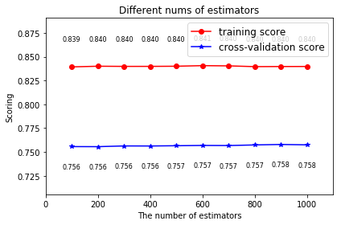

#### 5.3.2、各种树模型拟合效果对比


```python
from sklearn.ensemble import AdaBoostClassifier,GradientBoostingClassifier,ExtraTreesClassifier,RandomForestClassifier,BaggingClassifier
from sklearn.tree import DecisionTreeClassifier

learning_rate=0.1
n_estimators=50
random_state=2019
max_depth=9

clf_tree={
    'DTree':DecisionTreeClassifier(max_depth=max_depth,
                                  random_state=random_state),
    'Bagging':BaggingClassifier(n_estimators=n_estimators,
                               random_state=random_state),
    'RF':RandomForestClassifier(max_depth=max_depth,
                               random_state=random_state,
                               n_estimators=n_estimators),
    'ExtraTree':ExtraTreesClassifier(max_depth=max_depth,
                                   n_estimators=n_estimators,
                                   random_state=random_state),
    'AdaBoost':AdaBoostClassifier(n_estimators=n_estimators,
                                 random_state=random_state,
                                 learning_rate=learning_rate),
    'GraBoost':GradientBoostingClassifier(n_estimators=n_estimators,
                                      random_state=random_state,
                                      learning_rate=learning_rate,
                                      max_depth=max_depth)
}
```


```python
for keys in clf_tree.keys():
    print(clf_tree[keys])
```

    AdaBoostClassifier(algorithm='SAMME.R', base_estimator=None,
              learning_rate=0.1, n_estimators=50, random_state=2019)
    GradientBoostingClassifier(criterion='friedman_mse', init=None,
                  learning_rate=0.1, loss='deviance', max_depth=9,
                  max_features=None, max_leaf_nodes=None,
                  min_impurity_decrease=0.0, min_impurity_split=None,
                  min_samples_leaf=1, min_samples_split=2,
                  min_weight_fraction_leaf=0.0, n_estimators=50,
                  n_iter_no_change=None, presort='auto', random_state=2019,
                  subsample=1.0, tol=0.0001, validation_fraction=0.1,
                  verbose=0, warm_start=False)
    DecisionTreeClassifier(class_weight=None, criterion='gini', max_depth=9,
                max_features=None, max_leaf_nodes=None,
                min_impurity_decrease=0.0, min_impurity_split=None,
                min_samples_leaf=1, min_samples_split=2,
                min_weight_fraction_leaf=0.0, presort=False, random_state=2019,
                splitter='best')
    ExtraTreesClassifier(bootstrap=False, class_weight=None, criterion='gini',
               max_depth=9, max_features='auto', max_leaf_nodes=None,
               min_impurity_decrease=0.0, min_impurity_split=None,
               min_samples_leaf=1, min_samples_split=2,
               min_weight_fraction_leaf=0.0, n_estimators=50, n_jobs=None,
               oob_score=False, random_state=2019, verbose=0, warm_start=False)
    BaggingClassifier(base_estimator=None, bootstrap=True,
             bootstrap_features=False, max_features=1.0, max_samples=1.0,
             n_estimators=50, n_jobs=None, oob_score=False, random_state=2019,
             verbose=0, warm_start=False)
    RandomForestClassifier(bootstrap=True, class_weight=None, criterion='gini',
                max_depth=9, max_features='auto', max_leaf_nodes=None,
                min_impurity_decrease=0.0, min_impurity_split=None,
                min_samples_leaf=1, min_samples_split=2,
                min_weight_fraction_leaf=0.0, n_estimators=50, n_jobs=None,
                oob_score=False, random_state=2019, verbose=0,
                warm_start=False)


```python
from sklearn.model_selection import KFold

train_tree_score=[]
cv_tree_score=[]

k_ndcg=11

kf=KFold(n_splits=5,random_state=2019)

for keys in clf_tree.keys():
    clf=clf_tree[keys]
    print('%s'%(clf))
    train_iter_score=[]
    cv_iter_score=[]
    for train_index,test_index in kf.split(xtrain_new_stdsca,ytrain_le_new):
        x_train,x_test=xtrain_new_stdsca[train_index,:],xtrain_new_stdsca[test_index]
        y_train,y_test=ytrain_le_new[train_index],ytrain_le_new[test_index]
        
        clf.fit(x_train,y_train)
        y_pred=clf.predict_proba(x_test)
        
        train_ndcg_score=ndcg(y_train,clf.predict_proba(x_train),k=k_ndcg)
        ##这里不能写ndcg(y_train,y_train)
        cv_ndcg_score=ndcg(y_test,y_pred,k=k_ndcg)
        
        train_iter_score.append(train_ndcg_score)
        cv_iter_score.append(cv_ndcg_score)
        
    train_tree_score.append(np.mean(train_iter_score))
    cv_tree_score.append(np.mean(cv_iter_score))
    
    print('The train_score is %s.'%(np.mean(train_iter_score)))
    print('The cv_socre is %s.\n'%(np.mean(cv_iter_score)))
```

    AdaBoostClassifier(algorithm='SAMME.R', base_estimator=None,
              learning_rate=0.1, n_estimators=50, random_state=2019)
    The train_score is 0.7246096061427484.
    The cv_socre is 0.7048139466816957.
    
    GradientBoostingClassifier(criterion='friedman_mse', init=None,
                  learning_rate=0.1, loss='deviance', max_depth=9,
                  max_features=None, max_leaf_nodes=None,
                  min_impurity_decrease=0.0, min_impurity_split=None,
                  min_samples_leaf=1, min_samples_split=2,
                  min_weight_fraction_leaf=0.0, n_estimators=50,
                  n_iter_no_change=None, presort='auto', random_state=2019,
                  subsample=1.0, tol=0.0001, validation_fraction=0.1,
                  verbose=0, warm_start=False)
    The train_score is 0.944746824572419.
    The cv_socre is 0.7159867172089879.
    
    DecisionTreeClassifier(class_weight=None, criterion='gini', max_depth=9,
                max_features=None, max_leaf_nodes=None,
                min_impurity_decrease=0.0, min_impurity_split=None,
                min_samples_leaf=1, min_samples_split=2,
                min_weight_fraction_leaf=0.0, presort=False, random_state=2019,
                splitter='best')
    The train_score is 0.8339248668602005.
    The cv_socre is 0.6878397263014717.
    
    ExtraTreesClassifier(bootstrap=False, class_weight=None, criterion='gini',
               max_depth=9, max_features='auto', max_leaf_nodes=None,
               min_impurity_decrease=0.0, min_impurity_split=None,
               min_samples_leaf=1, min_samples_split=2,
               min_weight_fraction_leaf=0.0, n_estimators=50, n_jobs=None,
               oob_score=False, random_state=2019, verbose=0, warm_start=False)
    The train_score is 0.8363386885300805.
    The cv_socre is 0.7574253895950528.
    
    BaggingClassifier(base_estimator=None, bootstrap=True,
             bootstrap_features=False, max_features=1.0, max_samples=1.0,
             n_estimators=50, n_jobs=None, oob_score=False, random_state=2019,
             verbose=0, warm_start=False)
    The train_score is 0.946429410924576.
    The cv_socre is 0.7295387120401557.
    
    RandomForestClassifier(bootstrap=True, class_weight=None, criterion='gini',
                max_depth=9, max_features='auto', max_leaf_nodes=None,
                min_impurity_decrease=0.0, min_impurity_split=None,
                min_samples_leaf=1, min_samples_split=2,
                min_weight_fraction_leaf=0.0, n_estimators=50, n_jobs=None,
                oob_score=False, random_state=2019, verbose=0,
                warm_start=False)
    The train_score is 0.8386409029465518.
    The cv_socre is 0.7550780558329098.


​    


```python
plt.figure(figsize=(8,6))
plt.plot(clf_tree.keys(),train_tree_score,'ro-',label='training')
plt.plot(clf_tree.keys(),cv_tree_score,'b*-',label='cross-validation')
plt.xlabel('Tree-methods',fontsize=12)
plt.ylabel('Scoring')
plt.xticks(ticks=range(len(clf_tree.keys())),labels=clf_tree.keys(),rotation=90)
plt.ylim(np.min(train_tree_score)-0.05,np.max(train_tree_score)+0.05)
plt.title('Different tree methods',fontsize=14)
plt.legend(loc='lower right',fontsize=12)
for a,b in zip(clf_tree.keys(),train_tree_score):
    plt.text(a,b-0.025,'%.5f'%(b),ha='center',va='bottom',fontsize=10)
for a,b in zip(clf_tree.keys(),cv_tree_score):
    plt.text(a,b-0.025,'%.5f'%(b),ha='center',va='bottom',fontsize=10)
plt.tight_layout()
##Bagging默认就是决策树做基分类器
```


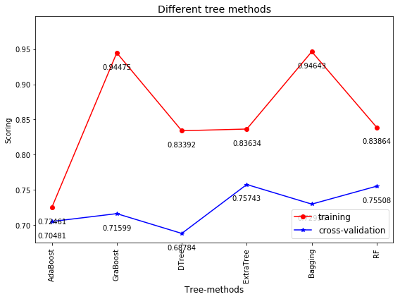


由图可以看出，RF和Bagging分数一样，因为Bagging默认也使用决策树做基分类器，即还是此时的Bagging就是一个RF

### 5.4、SVM


```python
from sklearn.svm import SVC,LinearSVC,NuSVC

tol=1e-4
max_iter=1000
random_state=2019

clf_svm={'SVM-rbf':SVC(kernel='rbf',
                       gamma='auto',
                       max_iter=max_iter,
                       tol=tol,
                       random_state=random_state,
                       decision_function_shape='ovr'),
         'SVM-poly':SVC(kernel='poly',
                        gamma='auto',
                       max_iter=max_iter,
                       tol=tol,
                       random_state=random_state,
                       decision_function_shape='ovr'),
         'SVM-linear':SVC(kernel='linear',
                          gamma='auto',
                         max_iter=max_iter,
                         tol=tol,
                         random_state=random_state,
                         decision_function_shape='ovr'),
         'LinearSVC':LinearSVC(max_iter=max_iter,
                              tol=tol,
                              random_state=random_state,
                              multi_class='ovr')#,
#         'NuSVC':NuSVC(nu=0.7,
 #                      tol=1e-3,
  #                     gamma='auto',
   #                    random_state=random_state,
    #                   decision_function_shape='ovr',
     #                  max_iter =-1)
}
##ovr是依次选定一类后，将剩下的所有类归为一类，依次输出分类概率，概率较大的在最后作为分类结果
##ovo是每两个类做一次分类输出分类概率（两两组合），依次按概率选出并叠加各个分类结果，最终选出次数最高的结果
##poly是多项式核函数，其参数比高斯核要多！
```


```python
from sklearn.model_selection import KFold

train_svm_score=[]
cv_svm_score=[]

kf=KFold(n_splits=5,random_state=random_state)

k_ndcg=5

for key in clf_svm.keys():
    clf=clf_svm[key]
    print(clf_svm[key])
    
    train_ndcg_score=[]
    cv_ndcg_score=[]
    
    for train_index,test_index in kf.split(xtrain_new_stdsca,ytrain_le_new):
        x_train,x_test=xtrain_new_stdsca[train_index,:],xtrain_new_stdsca[test_index,:]
        y_train,y_test=ytrain_le_new[train_index],ytrain_le_new[test_index]
        
        clf.fit(x_train,y_train)
        y_pred=clf.decision_function(x_test)
        
        train_ndcg=ndcg(y_train,clf.decision_function(x_train),k=k_ndcg)
        cv_ndcg=ndcg(y_test,y_pred,k=k_ndcg)
        
        train_ndcg_score.append(train_ndcg)
        cv_ndcg_score.append(cv_ndcg)
        
    print('Training score is %s.'%(np.mean(train_ndcg_score)))
    print('Cv score is %s.'%(np.mean(cv_ndcg_score)))
    
    train_svm_score.append(np.mean(train_ndcg_score))
    cv_svm_score.append(np.mean(cv_ndcg_score))
```

    SVC(C=1.0, cache_size=200, class_weight=None, coef0=0.0,
      decision_function_shape='ovr', degree=3, gamma='auto', kernel='poly',
      max_iter=1000, probability=False, random_state=2019, shrinking=True,
      tol=0.0001, verbose=False)


    Training score is 0.699445372966201.
    Cv score is 0.6916810757011943.
    SVC(C=1.0, cache_size=200, class_weight=None, coef0=0.0,
      decision_function_shape='ovr', degree=3, gamma='auto', kernel='linear',
      max_iter=1000, probability=False, random_state=2019, shrinking=True,
      tol=0.0001, verbose=False)


    Training score is 0.7230926385141765.
    Cv score is 0.6607866412446242.
    SVC(C=1.0, cache_size=200, class_weight=None, coef0=0.0,
      decision_function_shape='ovr', degree=3, gamma='auto', kernel='rbf',
      max_iter=1000, probability=False, random_state=2019, shrinking=True,
      tol=0.0001, verbose=False)


    Training score is 0.7547611590601255.
    Cv score is 0.7437424511720637.
    LinearSVC(C=1.0, class_weight=None, dual=True, fit_intercept=True,
         intercept_scaling=1, loss='squared_hinge', max_iter=1000,
         multi_class='ovr', penalty='l2', random_state=2019, tol=0.0001,
         verbose=0)


    Training score is 0.7520617701057801.
    Cv score is 0.5209215841106466.


```python
for i in clf_svm:
    print(i)
```

    SVM-poly
    SVM-linear
    SVM-rbf
    LinearSVC


```python
plt.figure(figsize=(8,6))
plt.plot(clf_svm.keys(),train_svm_score,'ro-',label='training score')
plt.plot(clf_svm.keys(),cv_svm_score,'b*-',label='cross-validation')
plt.legend(loc='best',fontsize=12)
plt.xticks(range(len(clf_svm.keys())),clf_svm.keys(),rotation=0,fontsize=10)
plt.ylim(np.min(cv_svm_score)-0.05,np.max(train_svm_score)+0.05)
plt.ylabel('Score',fontsize=12)
plt.xlabel('Different kernels',fontsize=12)
for a,b in zip(clf_svm.keys(),train_svm_score):
    plt.text(a,b-0.025,'%.4f'%(b),ha='center',va='bottom',fontsize=10)
for a,b in zip(clf_svm.keys(),cv_svm_score):
    plt.text(a,b-0.025,'%.4f'%(b),ha='center',va='bottom',fontsize=10)
plt.title('Different kernel of SVM')
plt.tight_layout()
```


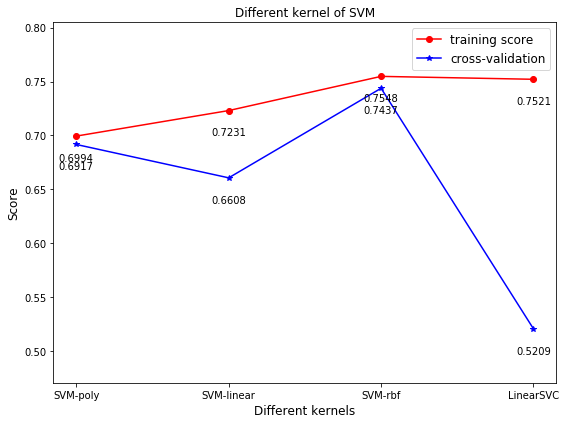

### 3.5、XGBOOST


```python
import xgboost as xgb
```


```python
def customized_eval(preds, dtrain):
    labels = dtrain.get_label()
    top = []
    for i in range(preds.shape[0]):
        top.append(np.argsort(preds[i])[::-1][:5])
    mat = np.reshape(np.repeat(labels,np.shape(top)[1]) == np.array(top).ravel(),np.array(top).shape).astype(int)
    score = np.mean(np.sum(mat/np.log2(np.arange(2, mat.shape[1] + 2)),axis = 1))
    return 'ndcg5', score

# xgboost parameters

NUM_XGB = 200

params = {}
params['colsample_bytree'] = 0.6
params['max_depth'] = 6
params['subsample'] = 0.8
params['eta'] = 0.3
params['seed'] = random_state
params['num_class'] = 12
params['objective'] = 'multi:softprob'   # output the probability instead of class. 

print (params)

train_score_iter = []
cv_score_iter = []

kf = KFold(n_splits = 5, random_state=random_state)

k_ndcg = 11


for train_index, test_index in kf.split(xtrain_new, ytrain_le_new):

    X_train, X_test = xtrain_new_stdsca[train_index, :], xtrain_new_stdsca[test_index, :]
    y_train, y_test = ytrain_le_new[train_index], ytrain_le_new[test_index]

    print (X_train.shape, X_test.shape)
    
    train_xgb = xgb.DMatrix(X_train, label= y_train)
    test_xgb = xgb.DMatrix(X_test, label = y_test)
    
    watchlist = [ (train_xgb,'train'), (test_xgb, 'test') ]

    bst = xgb.train(params, 
                     train_xgb,
                     NUM_XGB,
                     watchlist,
                     feval = customized_eval,
                     verbose_eval = 3,
                     early_stopping_rounds = 5)
    
    
    #bst = xgb.train( params, dtrain, num_round, evallist )

    y_pred = np.array(bst.predict(test_xgb))
    y_pred_train = np.array(bst.predict(train_xgb))
    
    # for binary classification: we used to use f1 score, precision, recall, auc score.
    # here for Airbnb we use the ndcg evaluation. 

    train_ndcg_score = ndcg(y_train, y_pred_train , k = k_ndcg)
    cv_ndcg_score = ndcg(y_test, y_pred, k=k_ndcg)

    train_score_iter.append(train_ndcg_score)
    cv_score_iter.append(cv_ndcg_score)

train_score_xgb = np.mean(train_score_iter)
cv_score_xgb = np.mean(cv_score_iter)

print ("\nThe training score is: {}".format(train_score_xgb))
print ("The cv score is: {}\n".format(cv_score_xgb))
```

    {'num_class': 12, 'objective': 'multi:softprob', 'eta': 0.3, 'subsample': 0.8, 'max_depth': 6, 'seed': 2019, 'colsample_bytree': 0.6}
    (1707, 493) (427, 493)
    [0]	train-merror:0.419449	test-merror:0.548009	train-ndcg5:0.807898	test-ndcg5:0.736301
    Multiple eval metrics have been passed: 'test-ndcg5' will be used for early stopping.
    
    Will train until test-ndcg5 hasn't improved in 5 rounds.
    [3]	train-merror:0.350908	test-merror:0.519906	train-ndcg5:0.848339	test-ndcg5:0.765481
    Stopping. Best iteration:
    [0]	train-merror:0.419449	test-merror:0.548009	train-ndcg5:0.807898	test-ndcg5:0.736301
    
    (1707, 493) (427, 493)
    [0]	train-merror:0.406561	test-merror:0.494145	train-ndcg5:0.81582	test-ndcg5:0.763744
    Multiple eval metrics have been passed: 'test-ndcg5' will be used for early stopping.
    
    Will train until test-ndcg5 hasn't improved in 5 rounds.
    [3]	train-merror:0.343878	test-merror:0.477752	train-ndcg5:0.852891	test-ndcg5:0.772117
    Stopping. Best iteration:
    [0]	train-merror:0.406561	test-merror:0.494145	train-ndcg5:0.81582	test-ndcg5:0.763744
    
    (1707, 493) (427, 493)
    [0]	train-merror:0.434681	test-merror:0.505855	train-ndcg5:0.806304	test-ndcg5:0.737318
    Multiple eval metrics have been passed: 'test-ndcg5' will be used for early stopping.
    
    Will train until test-ndcg5 hasn't improved in 5 rounds.
    [3]	train-merror:0.371998	test-merror:0.466042	train-ndcg5:0.843544	test-ndcg5:0.758238
    Stopping. Best iteration:
    [0]	train-merror:0.434681	test-merror:0.505855	train-ndcg5:0.806304	test-ndcg5:0.737318
    
    (1707, 493) (427, 493)
    [0]	train-merror:0.421793	test-merror:0.473068	train-ndcg5:0.81139	test-ndcg5:0.761361
    Multiple eval metrics have been passed: 'test-ndcg5' will be used for early stopping.
    
    Will train until test-ndcg5 hasn't improved in 5 rounds.
    [3]	train-merror:0.35208	test-merror:0.430913	train-ndcg5:0.849061	test-ndcg5:0.781359
    Stopping. Best iteration:
    [0]	train-merror:0.421793	test-merror:0.473068	train-ndcg5:0.81139	test-ndcg5:0.761361
    
    (1708, 493) (426, 493)
    [0]	train-merror:0.42096	test-merror:0.443662	train-ndcg5:0.813605	test-ndcg5:0.770256
    Multiple eval metrics have been passed: 'test-ndcg5' will be used for early stopping.
    
    Will train until test-ndcg5 hasn't improved in 5 rounds.
    [3]	train-merror:0.340164	test-merror:0.448357	train-ndcg5:0.853939	test-ndcg5:0.779354
    [6]	train-merror:0.326698	test-merror:0.43662	train-ndcg5:0.861471	test-ndcg5:0.781347
    Stopping. Best iteration:
    [1]	train-merror:0.384075	test-merror:0.474178	train-ndcg5:0.833795	test-ndcg5:0.767401


​    
​    The training score is: 0.8611696272068172
​    The cv score is: 0.7935429602707533


​    

## 4、Model comparison


```python
import seaborn as sns

model_cv_score=np.hstack((np.mean(cv_logs_score),cv_tree_score,cv_svm_score,cv_score_xgb))
model_name=np.hstack(('LogisticRegression',list(clf_tree.keys()),list(clf_svm.keys()),'Xgboost'))
##  clf_tree.keys()出来的是dict_keys，不是list对象

fig=plt.figure(figsize=(8,4))
sns.barplot(model_cv_score,model_name,palette='Blues_d')

plt.xticks(rotation=0,size=10)
plt.xlabel('Cv score')
plt.ylabel('Models')
plt.title('Cross-validation')

plt.tight_layout()
```


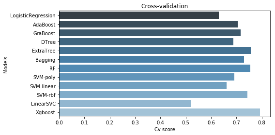


- xgboost的效果最好（不过只是1%的数据）
