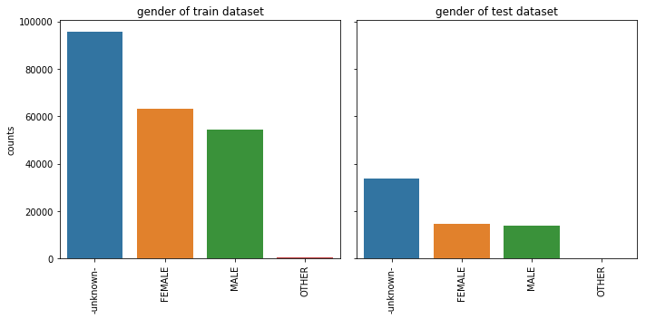
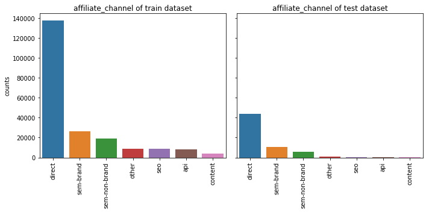
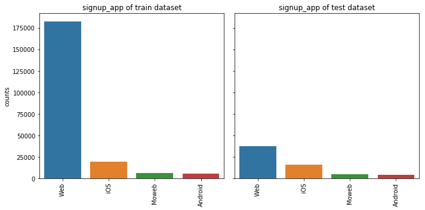
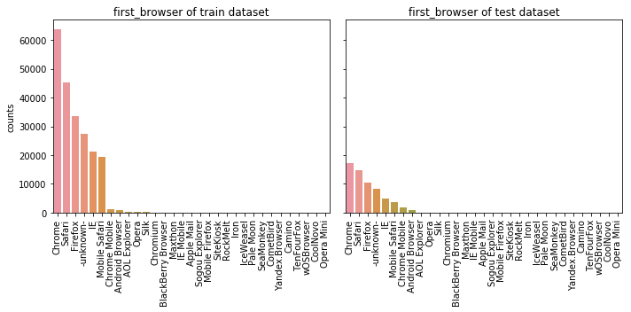
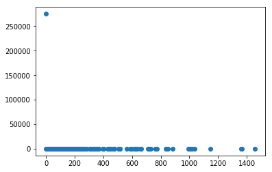
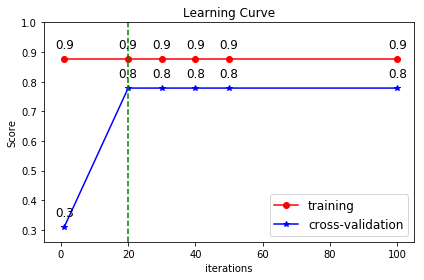
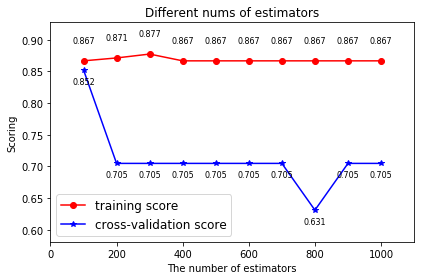

# Data Exploring


```python
import numpy as np
import pandas as pd
import matplotlib.pyplot as plt
import sklearn as sk
%matplotlib inline
import datetime
import os
import seaborn as sns
```


```python
train = pd.read_csv("train_users_2.csv")
test = pd.read_csv("test_users.csv")
```


```python
train.head()
```


<div>
<style scoped>
    .dataframe tbody tr th:only-of-type {
        vertical-align: middle;
    }

    .dataframe tbody tr th {
        vertical-align: top;
    }

    .dataframe thead th {
        text-align: right;
    }
</style>
<table border="1" class="dataframe">
  <thead>
    <tr style="text-align: right;">
      <th></th>
      <th>id</th>
      <th>date_account_created</th>
      <th>timestamp_first_active</th>
      <th>date_first_booking</th>
      <th>gender</th>
      <th>age</th>
      <th>signup_method</th>
      <th>signup_flow</th>
      <th>language</th>
      <th>affiliate_channel</th>
      <th>affiliate_provider</th>
      <th>first_affiliate_tracked</th>
      <th>signup_app</th>
      <th>first_device_type</th>
      <th>first_browser</th>
      <th>country_destination</th>
    </tr>
  </thead>
  <tbody>
    <tr>
      <th>0</th>
      <td>gxn3p5htnn</td>
      <td>2010-06-28</td>
      <td>20090319043255</td>
      <td>NaN</td>
      <td>-unknown-</td>
      <td>NaN</td>
      <td>facebook</td>
      <td>0</td>
      <td>en</td>
      <td>direct</td>
      <td>direct</td>
      <td>untracked</td>
      <td>Web</td>
      <td>Mac Desktop</td>
      <td>Chrome</td>
      <td>NDF</td>
    </tr>
    <tr>
      <th>1</th>
      <td>820tgsjxq7</td>
      <td>2011-05-25</td>
      <td>20090523174809</td>
      <td>NaN</td>
      <td>MALE</td>
      <td>38.0</td>
      <td>facebook</td>
      <td>0</td>
      <td>en</td>
      <td>seo</td>
      <td>google</td>
      <td>untracked</td>
      <td>Web</td>
      <td>Mac Desktop</td>
      <td>Chrome</td>
      <td>NDF</td>
    </tr>
    <tr>
      <th>2</th>
      <td>4ft3gnwmtx</td>
      <td>2010-09-28</td>
      <td>20090609231247</td>
      <td>2010-08-02</td>
      <td>FEMALE</td>
      <td>56.0</td>
      <td>basic</td>
      <td>3</td>
      <td>en</td>
      <td>direct</td>
      <td>direct</td>
      <td>untracked</td>
      <td>Web</td>
      <td>Windows Desktop</td>
      <td>IE</td>
      <td>US</td>
    </tr>
    <tr>
      <th>3</th>
      <td>bjjt8pjhuk</td>
      <td>2011-12-05</td>
      <td>20091031060129</td>
      <td>2012-09-08</td>
      <td>FEMALE</td>
      <td>42.0</td>
      <td>facebook</td>
      <td>0</td>
      <td>en</td>
      <td>direct</td>
      <td>direct</td>
      <td>untracked</td>
      <td>Web</td>
      <td>Mac Desktop</td>
      <td>Firefox</td>
      <td>other</td>
    </tr>
    <tr>
      <th>4</th>
      <td>87mebub9p4</td>
      <td>2010-09-14</td>
      <td>20091208061105</td>
      <td>2010-02-18</td>
      <td>-unknown-</td>
      <td>41.0</td>
      <td>basic</td>
      <td>0</td>
      <td>en</td>
      <td>direct</td>
      <td>direct</td>
      <td>untracked</td>
      <td>Web</td>
      <td>Mac Desktop</td>
      <td>Chrome</td>
      <td>US</td>
    </tr>
  </tbody>
</table>
</div>


```python
test.head()
```


<div>
<style scoped>
    .dataframe tbody tr th:only-of-type {
        vertical-align: middle;
    }

    .dataframe tbody tr th {
        vertical-align: top;
    }

    .dataframe thead th {
        text-align: right;
    }
</style>
<table border="1" class="dataframe">
  <thead>
    <tr style="text-align: right;">
      <th></th>
      <th>id</th>
      <th>date_account_created</th>
      <th>timestamp_first_active</th>
      <th>date_first_booking</th>
      <th>gender</th>
      <th>age</th>
      <th>signup_method</th>
      <th>signup_flow</th>
      <th>language</th>
      <th>affiliate_channel</th>
      <th>affiliate_provider</th>
      <th>first_affiliate_tracked</th>
      <th>signup_app</th>
      <th>first_device_type</th>
      <th>first_browser</th>
    </tr>
  </thead>
  <tbody>
    <tr>
      <th>0</th>
      <td>5uwns89zht</td>
      <td>2014-07-01</td>
      <td>20140701000006</td>
      <td>NaN</td>
      <td>FEMALE</td>
      <td>35.0</td>
      <td>facebook</td>
      <td>0</td>
      <td>en</td>
      <td>direct</td>
      <td>direct</td>
      <td>untracked</td>
      <td>Moweb</td>
      <td>iPhone</td>
      <td>Mobile Safari</td>
    </tr>
    <tr>
      <th>1</th>
      <td>jtl0dijy2j</td>
      <td>2014-07-01</td>
      <td>20140701000051</td>
      <td>NaN</td>
      <td>-unknown-</td>
      <td>NaN</td>
      <td>basic</td>
      <td>0</td>
      <td>en</td>
      <td>direct</td>
      <td>direct</td>
      <td>untracked</td>
      <td>Moweb</td>
      <td>iPhone</td>
      <td>Mobile Safari</td>
    </tr>
    <tr>
      <th>2</th>
      <td>xx0ulgorjt</td>
      <td>2014-07-01</td>
      <td>20140701000148</td>
      <td>NaN</td>
      <td>-unknown-</td>
      <td>NaN</td>
      <td>basic</td>
      <td>0</td>
      <td>en</td>
      <td>direct</td>
      <td>direct</td>
      <td>linked</td>
      <td>Web</td>
      <td>Windows Desktop</td>
      <td>Chrome</td>
    </tr>
    <tr>
      <th>3</th>
      <td>6c6puo6ix0</td>
      <td>2014-07-01</td>
      <td>20140701000215</td>
      <td>NaN</td>
      <td>-unknown-</td>
      <td>NaN</td>
      <td>basic</td>
      <td>0</td>
      <td>en</td>
      <td>direct</td>
      <td>direct</td>
      <td>linked</td>
      <td>Web</td>
      <td>Windows Desktop</td>
      <td>IE</td>
    </tr>
    <tr>
      <th>4</th>
      <td>czqhjk3yfe</td>
      <td>2014-07-01</td>
      <td>20140701000305</td>
      <td>NaN</td>
      <td>-unknown-</td>
      <td>NaN</td>
      <td>basic</td>
      <td>0</td>
      <td>en</td>
      <td>direct</td>
      <td>direct</td>
      <td>untracked</td>
      <td>Web</td>
      <td>Mac Desktop</td>
      <td>Safari</td>
    </tr>
  </tbody>
</table>
</div>


```python
print(train.info(),'\n',test.info())
```

    <class 'pandas.core.frame.DataFrame'>
    RangeIndex: 213451 entries, 0 to 213450
    Data columns (total 16 columns):
    id                         213451 non-null object
    date_account_created       213451 non-null object
    timestamp_first_active     213451 non-null int64
    date_first_booking         88908 non-null object
    gender                     213451 non-null object
    age                        125461 non-null float64
    signup_method              213451 non-null object
    signup_flow                213451 non-null int64
    language                   213451 non-null object
    affiliate_channel          213451 non-null object
    affiliate_provider         213451 non-null object
    first_affiliate_tracked    207386 non-null object
    signup_app                 213451 non-null object
    first_device_type          213451 non-null object
    first_browser              213451 non-null object
    country_destination        213451 non-null object
    dtypes: float64(1), int64(2), object(13)
    memory usage: 26.1+ MB
    <class 'pandas.core.frame.DataFrame'>
    RangeIndex: 62096 entries, 0 to 62095
    Data columns (total 15 columns):
    id                         62096 non-null object
    date_account_created       62096 non-null object
    timestamp_first_active     62096 non-null int64
    date_first_booking         0 non-null float64
    gender                     62096 non-null object
    age                        33220 non-null float64
    signup_method              62096 non-null object
    signup_flow                62096 non-null int64
    language                   62096 non-null object
    affiliate_channel          62096 non-null object
    affiliate_provider         62096 non-null object
    first_affiliate_tracked    62076 non-null object
    signup_app                 62096 non-null object
    first_device_type          62096 non-null object
    first_browser              62096 non-null object
    dtypes: float64(2), int64(2), object(11)
    memory usage: 7.1+ MB
    None 
     None
    


```python
print(train.shape,test.shape)
print(train.isnull().sum(),'\n',test.isnull().sum())
```

    (213451, 16) (62096, 15)
    id                              0
    date_account_created            0
    timestamp_first_active          0
    date_first_booking         124543
    gender                          0
    age                         87990
    signup_method                   0
    signup_flow                     0
    language                        0
    affiliate_channel               0
    affiliate_provider              0
    first_affiliate_tracked      6065
    signup_app                      0
    first_device_type               0
    first_browser                   0
    country_destination             0
    dtype: int64 
     id                             0
    date_account_created           0
    timestamp_first_active         0
    date_first_booking         62096
    gender                         0
    age                        28876
    signup_method                  0
    signup_flow                    0
    language                       0
    affiliate_channel              0
    affiliate_provider             0
    first_affiliate_tracked       20
    signup_app                     0
    first_device_type              0
    first_browser                  0
    dtype: int64
    

## Explore Each Feature

### date_account_created


```python
dac_train=train.date_account_created.value_counts()
dac_test=test.date_account_created.value_counts()
print(dac_train,dac_test)
print('train.date_account_created:',
      dac_train.describe(),
      'test.date_account_created:\n',
      dac_test.describe())
```

    2014-05-13    674
    2014-06-24    670
    2014-06-25    636
    2014-05-20    632
    2014-05-14    622
    2014-06-03    602
    2014-05-21    602
    2014-06-16    598
    2014-06-11    593
    2014-05-28    590
    2014-06-30    590
    2014-06-26    587
    2014-04-23    587
    2014-06-23    586
    2014-06-09    577
    2014-06-18    564
    2014-06-19    564
    2014-06-04    562
    2014-06-27    557
    2014-05-19    556
    2014-06-10    555
    2014-06-05    550
    2014-06-17    548
    2014-06-20    544
    2014-05-22    543
    2014-06-02    534
    2014-05-16    534
    2014-05-15    530
    2014-06-12    524
    2014-04-29    519
                 ... 
    2010-06-26      2
    2010-02-08      2
    2010-03-04      2
    2010-04-08      2
    2010-01-21      2
    2010-02-03      2
    2010-06-12      2
    2010-03-28      2
    2010-02-17      2
    2010-01-16      2
    2010-04-16      2
    2010-02-04      2
    2010-01-30      2
    2010-02-18      2
    2010-03-21      2
    2010-05-29      2
    2010-01-02      1
    2010-04-24      1
    2010-04-11      1
    2010-01-23      1
    2010-02-14      1
    2010-01-01      1
    2010-06-18      1
    2010-01-28      1
    2010-01-19      1
    2010-04-01      1
    2010-01-31      1
    2010-01-08      1
    2010-01-03      1
    2010-03-09      1
    Name: date_account_created, Length: 1634, dtype: int64 2014-07-23    1105
    2014-07-22    1052
    2014-07-17     978
    2014-07-24     923
    2014-07-18     892
    2014-07-21     888
    2014-08-27     872
    2014-08-26     841
    2014-07-29     816
    2014-08-06     790
    2014-07-30     786
    2014-08-12     785
    2014-08-11     781
    2014-08-05     772
    2014-08-28     772
    2014-07-28     764
    2014-07-16     757
    2014-07-25     754
    2014-09-16     751
    2014-07-31     751
    2014-08-14     742
    2014-08-19     741
    2014-08-07     739
    2014-09-10     739
    2014-08-08     738
    2014-07-20     738
    2014-08-13     731
    2014-09-03     729
    2014-08-04     728
    2014-08-25     725
                  ... 
    2014-08-31     614
    2014-09-17     612
    2014-09-05     612
    2014-08-23     611
    2014-07-09     610
    2014-08-17     609
    2014-07-10     607
    2014-08-24     606
    2014-09-19     605
    2014-08-10     603
    2014-09-12     600
    2014-07-01     599
    2014-09-13     597
    2014-09-01     592
    2014-08-02     582
    2014-09-07     555
    2014-09-27     548
    2014-09-06     543
    2014-09-21     540
    2014-09-25     533
    2014-09-14     532
    2014-09-20     532
    2014-09-26     531
    2014-07-11     530
    2014-09-28     520
    2014-07-06     475
    2014-07-12     472
    2014-07-04     445
    2014-07-05     421
    2014-07-13     401
    Name: date_account_created, Length: 92, dtype: int64
    train.date_account_created: count    1634.000000
    mean      130.630967
    std       139.327895
    min         1.000000
    25%        15.000000
    50%        79.000000
    75%       201.000000
    max       674.000000
    Name: date_account_created, dtype: float64 test.date_account_created:
     count      92.000000
    mean      674.956522
    std       122.568116
    min       401.000000
    25%       606.750000
    50%       662.000000
    75%       739.000000
    max      1105.000000
    Name: date_account_created, dtype: float64
    


```python
dac_train_data=pd.to_datetime(dac_train.index)
dac_test_data=pd.to_datetime(dac_test.index)

dac_train_day=dac_train_data-dac_train_data.min()
dac_test_day=dac_test_data-dac_train_data.min()

print(dac_train_day,'\n',dac_test_day)
```

    TimedeltaIndex(['1593 days', '1635 days', '1636 days', '1600 days',
                    '1594 days', '1614 days', '1601 days', '1627 days',
                    '1622 days', '1608 days',
                    ...
                      '44 days',    '0 days',  '168 days',   '27 days',
                      '18 days',   '90 days',   '30 days',    '7 days',
                       '2 days',   '67 days'],
                   dtype='timedelta64[ns]', length=1634, freq=None) 
     TimedeltaIndex(['1664 days', '1663 days', '1658 days', '1665 days',
                    '1659 days', '1662 days', '1699 days', '1698 days',
                    '1670 days', '1678 days', '1671 days', '1684 days',
                    '1683 days', '1677 days', '1700 days', '1669 days',
                    '1657 days', '1666 days', '1719 days', '1672 days',
                    '1686 days', '1691 days', '1679 days', '1713 days',
                    '1680 days', '1661 days', '1685 days', '1706 days',
                    '1676 days', '1697 days', '1727 days', '1660 days',
                    '1668 days', '1726 days', '1733 days', '1673 days',
                    '1705 days', '1732 days', '1693 days', '1667 days',
                    '1711 days', '1707 days', '1681 days', '1690 days',
                    '1694 days', '1649 days', '1692 days', '1656 days',
                    '1688 days', '1712 days', '1725 days', '1721 days',
                    '1687 days', '1702 days', '1643 days', '1718 days',
                    '1714 days', '1675 days', '1655 days', '1644 days',
                    '1648 days', '1701 days', '1703 days', '1720 days',
                    '1708 days', '1695 days', '1650 days', '1689 days',
                    '1651 days', '1696 days', '1722 days', '1682 days',
                    '1715 days', '1642 days', '1716 days', '1704 days',
                    '1674 days', '1710 days', '1730 days', '1709 days',
                    '1724 days', '1728 days', '1717 days', '1723 days',
                    '1729 days', '1652 days', '1731 days', '1647 days',
                    '1653 days', '1645 days', '1646 days', '1654 days'],
                   dtype='timedelta64[ns]', freq=None)
    


```python
dac_train_day.days
```


    Int64Index([1593, 1635, 1636, 1600, 1594, 1614, 1601, 1627, 1622, 1608,
                ...
                  44,    0,  168,   27,   18,   90,   30,    7,    2,   67],
               dtype='int64', length=1634)


```python
plt.scatter(dac_train_day.days,dac_train.values,color='r',label='train_datasets')
plt.scatter(dac_test_day.days,dac_test.values,color='b',label='test_datasets')
plt.xlabel("Days")
plt.ylabel("The number of accounts created")
plt.title('Accounts created vs day')
```


    Text(0.5, 1.0, 'Accounts created vs day')


### timestamp_first_active


```python
tfa_train=train.timestamp_first_active
tfa_train
```


    0         20090319043255
    1         20090523174809
    2         20090609231247
    3         20091031060129
    4         20091208061105
    5         20100101215619
    6         20100102012558
    7         20100103191905
    8         20100104004211
    9         20100104023758
    10        20100104194251
    11        20100105051812
    12        20100105060859
    13        20100105083259
    14        20100107055820
    15        20100107204555
    16        20100107215125
    17        20100107224625
    18        20100108015641
    19        20100110010817
    20        20100110152120
    21        20100110220941
    22        20100111031438
    23        20100111224015
    24        20100111230808
    25        20100112131444
    26        20100112155420
    27        20100112205949
    28        20100113044650
    29        20100113064333
                   ...      
    213421    20140630231137
    213422    20140630231246
    213423    20140630231548
    213424    20140630231859
    213425    20140630232119
    213426    20140630232331
    213427    20140630232539
    213428    20140630232634
    213429    20140630232712
    213430    20140630233132
    213431    20140630233203
    213432    20140630233224
    213433    20140630233427
    213434    20140630233640
    213435    20140630233851
    213436    20140630234113
    213437    20140630234243
    213438    20140630234429
    213439    20140630234729
    213440    20140630234933
    213441    20140630235151
    213442    20140630235309
    213443    20140630235340
    213444    20140630235352
    213445    20140630235547
    213446    20140630235636
    213447    20140630235719
    213448    20140630235754
    213449    20140630235822
    213450    20140630235824
    Name: timestamp_first_active, Length: 213451, dtype: int64


```python
tfa_train=train.timestamp_first_active.map(lambda x: datetime.datetime.strptime(str(x),'%Y%m%d%H%M%S'))
tfa_train.head()
```


    0   2009-03-19 04:32:55
    1   2009-05-23 17:48:09
    2   2009-06-09 23:12:47
    3   2009-10-31 06:01:29
    4   2009-12-08 06:11:05
    Name: timestamp_first_active, dtype: datetime64[ns]


```python
tfa_train.describe()
```


    count                  213451
    unique                 213451
    top       2013-07-01 05:26:34
    freq                        1
    first     2009-03-19 04:32:55
    last      2014-06-30 23:58:24
    Name: timestamp_first_active, dtype: object


### age


```python
train.age.isnull().sum()
```


    87990


```python
age_train=[train.age.isnull().sum(),
           train.query('age<15').age.shape[0],
           train.query('age>=15&age<90').age.shape[0],
           train.query('age>=90').age.shape[0]]
age_test=[test.age.isnull().sum(),
          test.query('age<15').age.shape[0],
          test.query('age>=15&age<90').age.shape[0],
          test.query('age>=90').age.shape[0]]

columns=['Null','age<15','15<=age<90','age>90']

fig,(ax1,ax2)=plt.subplots(1,2,sharex=True,sharey=True,figsize=(10,5))
sns.barplot(columns,age_train,ax=ax1)
sns.barplot(columns,age_test,ax=ax2)
ax1.set_title('train datasets')
ax2.set_title('test datasets')
ax1.set_ylabel('counts')
```


    Text(0, 0.5, 'counts')


### Categorical features


```python
cate_feats = ['gender', 
             'signup_method', 
             'signup_flow', 
             'language', 
             'affiliate_channel', 
             'affiliate_provider', 
             'first_affiliate_tracked', 
             'signup_app', 
             'first_device_type', 
             'first_browser']

def feature_barplot(feature, df_train = train, df_test = test, figsize=(10,5), rot = 90, saveimg = False):
    
    feat_train = df_train[feature].value_counts()
    feat_test = df_test[feature].value_counts()
    
    fig_feature, (ax1,ax2) = plt.subplots(1,2,sharex=True, sharey = True, figsize = figsize)

    sns.barplot(feat_train.index.values, feat_train.values, ax = ax1)
    sns.barplot(feat_test.index.values, feat_test.values, ax = ax2)
    
    ax1.set_xticklabels(ax1.xaxis.get_majorticklabels(), rotation = rot)
    ax2.set_xticklabels(ax1.xaxis.get_majorticklabels(), rotation = rot)

    ax1.set_title(feature + ' of train dataset')
    ax2.set_title(feature + ' of test dataset')
    ax1.set_ylabel('counts')
    
    plt.tight_layout()
    
for feat in cate_feats:
    feature_barplot(feature = feat)
```














```python
from pandas import Series,DataFrame,merge
import numpy as np
data=DataFrame([{"id":0,"name":'lxh',"age":20,"cp":'lm'},{"id":1,"name":'xiao',"age":40,"cp":'ly'},{"id":2,"name":'hua',"age":4,"cp":'yry'},{"id":3,"name":'be',"age":70,"cp":'old'}])
data1=DataFrame([{"id":100,"name":'lxh','cs':10},{"id":101,"name":'xiao','cs':40},{"id":102,"name":'hua2','cs':50}])
data2=DataFrame([{"id":0,"name":'lxh','cs':10},{"id":101,"name":'xiao','cs':40},{"id":102,"name":'hua2','cs':50}])

print(data)
print(data1)
print(data2)

print('左外连接\r\n',merge(data,data1,on="name",how="left",suffixes=('_a','_b')))
print('左外连接1\r\n',merge(data1,data,on="name",how="left"))
print('右外连接\r\n',merge(data,data1,on="name",how="right"))
data3=DataFrame([{"mid":0,"mname":'lxh','cs':10},{"mid":101,"mname":'xiao','cs':40},{"mid":102,"mname":'hua2','cs':50}])

#当左右两个DataFrame的列名不同，当又想做为连接键时可以使用left_on与right_on来指定连接键
print("使用left_on与right_on来指定列名字不同的连接键\r\n",merge(data,data3,left_on=["name","id"],right_on=["mname","mid"]))
```

       age   cp  id  name
    0   20   lm   0   lxh
    1   40   ly   1  xiao
    2    4  yry   2   hua
    3   70  old   3    be
       cs   id  name
    0  10  100   lxh
    1  40  101  xiao
    2  50  102  hua2
       cs   id  name
    0  10    0   lxh
    1  40  101  xiao
    2  50  102  hua2
    左外连接
        age   cp  id_a  name    cs   id_b
    0   20   lm     0   lxh  10.0  100.0
    1   40   ly     1  xiao  40.0  101.0
    2    4  yry     2   hua   NaN    NaN
    3   70  old     3    be   NaN    NaN
    左外连接1
        cs  id_x  name   age   cp  id_y
    0  10   100   lxh  20.0   lm   0.0
    1  40   101  xiao  40.0   ly   1.0
    2  50   102  hua2   NaN  NaN   NaN
    右外连接
         age   cp  id_x  name  cs  id_y
    0  20.0   lm   0.0   lxh  10   100
    1  40.0   ly   1.0  xiao  40   101
    2   NaN  NaN   NaN  hua2  50   102
    使用left_on与right_on来指定列名字不同的连接键
        age  cp  id name  cs  mid mname
    0   20  lm   0  lxh  10    0   lxh
    

# Featur Enginnering


```python
import numpy as np
import pandas as pd
import matplotlib.pyplot as plt
import sklearn as sk
#import pickle
import datetime
from datetime import date
#import os
import seaborn as sns
from sklearn.preprocessing import *
from sklearn.preprocessing import LabelEncoder
from sklearn.model_selection import StratifiedShuffleSplit
import seaborn as sns
%matplotlib inline
```

## session数据集


```python
df_session=pd.read_csv('sessions.csv')
print(df_session.columns)
```

    Index(['user_id', 'action', 'action_type', 'action_detail', 'device_type',
           'secs_elapsed'],
          dtype='object')
    


```python
for i in df_session.columns:
    print(df_session[i].value_counts().head())
```

    vcmr2jh5ix    2085
    yu5bdalz2b    1811
    qkbkunyzq7    1780
    s5ez13snz0    1685
    bp4mwnlbxs    1526
    Name: user_id, dtype: int64
    show                     209655
    search_results           109430
    personalize              105718
    lookup                    88302
    ajax_refresh_subtotal     71482
    Name: action, dtype: int64
    view         247360
    click        241418
    data         221806
    -unknown-    102925
    submit        76292
    Name: action_type, dtype: int64
    view_search_results            186546
    wishlist_content_update        111091
    -unknown-                      102925
    p3                             101173
    change_trip_characteristics     75227
    Name: action_detail, dtype: int64
    Mac Desktop                         478574
    Windows Desktop                     326346
    Android App Unknown Phone/Tablet     98002
    iPad Tablet                          72071
    iPhone                               43406
    Name: device_type, dtype: int64
    0.0    7222
    4.0    1920
    3.0    1913
    1.0    1844
    2.0    1842
    Name: secs_elapsed, dtype: int64
    


```python
df_session['id']=df_session['user_id']
df_session.drop(['user_id'],axis=1).head()
```


<div>
<style scoped>
    .dataframe tbody tr th:only-of-type {
        vertical-align: middle;
    }

    .dataframe tbody tr th {
        vertical-align: top;
    }

    .dataframe thead th {
        text-align: right;
    }
</style>
<table border="1" class="dataframe">
  <thead>
    <tr style="text-align: right;">
      <th></th>
      <th>action</th>
      <th>action_type</th>
      <th>action_detail</th>
      <th>device_type</th>
      <th>secs_elapsed</th>
      <th>id</th>
    </tr>
  </thead>
  <tbody>
    <tr>
      <th>0</th>
      <td>lookup</td>
      <td>NaN</td>
      <td>NaN</td>
      <td>Windows Desktop</td>
      <td>319.0</td>
      <td>d1mm9tcy42</td>
    </tr>
    <tr>
      <th>1</th>
      <td>search_results</td>
      <td>click</td>
      <td>view_search_results</td>
      <td>Windows Desktop</td>
      <td>67753.0</td>
      <td>d1mm9tcy42</td>
    </tr>
    <tr>
      <th>2</th>
      <td>lookup</td>
      <td>NaN</td>
      <td>NaN</td>
      <td>Windows Desktop</td>
      <td>301.0</td>
      <td>d1mm9tcy42</td>
    </tr>
    <tr>
      <th>3</th>
      <td>search_results</td>
      <td>click</td>
      <td>view_search_results</td>
      <td>Windows Desktop</td>
      <td>22141.0</td>
      <td>d1mm9tcy42</td>
    </tr>
    <tr>
      <th>4</th>
      <td>lookup</td>
      <td>NaN</td>
      <td>NaN</td>
      <td>Windows Desktop</td>
      <td>957.0</td>
      <td>jpmpj40cvk</td>
    </tr>
  </tbody>
</table>
</div>


```python
df_session.shape
```


    (1048575, 7)


```python
df_session.isnull().sum()
```


    user_id            2797
    action             7873
    action_type      143097
    action_detail    143097
    device_type           0
    secs_elapsed      11067
    id                 2797
    dtype: int64


```python
df_session.action=df_session.action.fillna('NAN')
df_session.action_type=df_session.action_type.fillna('NAN')
df_session.action_detail=df_session.action_detail.fillna('NAN')
df_session.device_type=df_session.device_type.fillna('NAN')
```


```python
act=dict(zip(*np.unique(df_session.action,return_counts=True)))
df_session.action=df_session.action.apply(lambda x: 'OTHER' if act[x]<100 else x)##apply函数是对每一列进行函数操作，map是对每个元素进行函数操作
```


```python
dgr_session=df_session.groupby(['id'])
for i in dgr_session:
    m=i[0]
    print(m)
    l=[]
    l.append(m)
    l.append(1)
    l+=[2]
    print(l)
    break
```

    007gj7kqdk
    ['007gj7kqdk', 1, 2]
    


```python
df_session.action.value_counts().head(10)
```


    show                     209655
    search_results           109430
    personalize              105718
    lookup                    88302
    ajax_refresh_subtotal     71482
    index                     69441
    similar_listings          53814
    update                    38829
    search                    26520
    header_userpic            17332
    Name: action, dtype: int64


```python
f_act=df_session.action.value_counts().argsort()
f_act_detail = df_session.action_detail.value_counts().argsort()
f_act_type = df_session.action_type.value_counts().argsort()
f_dev_type = df_session.device_type.value_counts().argsort()
```


```python
samples=[]
cont=0
ln=len(dgr_session)

for g in dgr_session:
    if cont%10000==0:
        print('%s from %s'%(cont,ln))
    gr=g[1]
    l=[]
    l.append(g[0])
    l.append(len(gr))
    sev=gr.secs_elapsed.fillna(0).values
    
    c_act=[0]*len(f_act)
    for i,v in enumerate(gr.action.values):
        c_act[f_act[v]]+=1
    _,c_act_uqc=np.unique(gr.action.values,return_counts=True)
    c_act+=[len(c_act_uqc),np.mean(c_act_uqc),np.std(c_act_uqc)]
    l=l+c_act
    
    c_act_detail = [0] * len(f_act_detail)
    for i,v in enumerate(gr.action_detail.values):
        c_act_detail[f_act_detail[v]] += 1 
    _, c_act_det_uqc = np.unique(gr.action_detail.values, return_counts=True)
    c_act_detail += [len(c_act_det_uqc), np.mean(c_act_det_uqc), np.std(c_act_det_uqc)]
    l=l+c_act_detail
    
    c_act_type=[0]*len(f_act_type)
    l_act_type=[0]*len(f_act_type)
    for i,v in enumerate(gr.action_type.values):
        c_act_type[f_act_type[v]]+=1
        l_act_type[f_act_type[v]]+=sev[i]
    l_act_type=np.log(1+np.array(l_act_type)).tolist()
    _, c_act_type_uqc = np.unique(gr.action_type.values, return_counts=True)
    c_act_type += [len(c_act_type_uqc), np.mean(c_act_type_uqc), np.std(c_act_type_uqc)]
    l=l+c_act_type+l_act_type
    
    c_dev_type=[0]*len(f_dev_type)
    for i,v in enumerate(gr.device_type.values):
        c_dev_type[f_dev_type[v]]+=1
    _, c_dev_type_uqc=np.unique(gr.device_type.values,return_counts=True)
    c_dev_type+=[len(c_dev_type_uqc),np.mean(c_dev_type_uqc),np.std(c_dev_type_uqc)]
    l=l+c_dev_type
    
    l_secs=[0]*5
    l_log=[0]*15
    if len(sev)>0:
        l_secs[0]=np.log(1+np.sum(sev))
        l_secs[1]=np.log(1+np.mean(sev))
        l_secs[2]=np.log(1+np.std(sev))
        l_secs[3]=np.log(1+np.median(sev))
        l_secs[4]=l_secs[0]/float(l[1])
    
        log_sev=np.log(1+sev).astype(int)
        l_log=np.bincount(log_sev,minlength=15).tolist()
    l=l+l_secs+l_log
    
    samples.append(l)
    cont+=1
```

    0 from 15588
    10000 from 15588
    


```python
samples=np.array(samples)
samp_ar=samples[:,1:].astype(np.float16)##将数据改为浮点型
samp_id=samples[:,0]

col_names=[]
for i in range(len(samples[0])-1):
    col_names.append('c_'+str(i))
df_agg_sess=pd.DataFrame(samp_ar,columns=col_names)##构造用户数据矩阵
df_agg_sess['id']=samp_id
df_agg_sess.index=df_agg_sess.id
```


```python
df_agg_sess.shape
```


    (15588, 293)


## train和test数据集


```python
train=pd.read_csv('train_users_2.csv')
test=pd.read_csv('test_users.csv')

labels=train.country_destination.values
id_test=test['id'].values
id_test
```


    array(['5uwns89zht', 'jtl0dijy2j', 'xx0ulgorjt', ..., 'fa6260ziny',
           '87k0fy4ugm', '9uqfg8txu3'], dtype=object)


```python
train_row=train.shape[0]
train_row
```


    213451


```python
train.head()
```


<div>
<style scoped>
    .dataframe tbody tr th:only-of-type {
        vertical-align: middle;
    }

    .dataframe tbody tr th {
        vertical-align: top;
    }

    .dataframe thead th {
        text-align: right;
    }
</style>
<table border="1" class="dataframe">
  <thead>
    <tr style="text-align: right;">
      <th></th>
      <th>id</th>
      <th>date_account_created</th>
      <th>timestamp_first_active</th>
      <th>date_first_booking</th>
      <th>gender</th>
      <th>age</th>
      <th>signup_method</th>
      <th>signup_flow</th>
      <th>language</th>
      <th>affiliate_channel</th>
      <th>affiliate_provider</th>
      <th>first_affiliate_tracked</th>
      <th>signup_app</th>
      <th>first_device_type</th>
      <th>first_browser</th>
      <th>country_destination</th>
    </tr>
  </thead>
  <tbody>
    <tr>
      <th>0</th>
      <td>gxn3p5htnn</td>
      <td>2010-06-28</td>
      <td>20090319043255</td>
      <td>NaN</td>
      <td>-unknown-</td>
      <td>NaN</td>
      <td>facebook</td>
      <td>0</td>
      <td>en</td>
      <td>direct</td>
      <td>direct</td>
      <td>untracked</td>
      <td>Web</td>
      <td>Mac Desktop</td>
      <td>Chrome</td>
      <td>NDF</td>
    </tr>
    <tr>
      <th>1</th>
      <td>820tgsjxq7</td>
      <td>2011-05-25</td>
      <td>20090523174809</td>
      <td>NaN</td>
      <td>MALE</td>
      <td>38.0</td>
      <td>facebook</td>
      <td>0</td>
      <td>en</td>
      <td>seo</td>
      <td>google</td>
      <td>untracked</td>
      <td>Web</td>
      <td>Mac Desktop</td>
      <td>Chrome</td>
      <td>NDF</td>
    </tr>
    <tr>
      <th>2</th>
      <td>4ft3gnwmtx</td>
      <td>2010-09-28</td>
      <td>20090609231247</td>
      <td>2010-08-02</td>
      <td>FEMALE</td>
      <td>56.0</td>
      <td>basic</td>
      <td>3</td>
      <td>en</td>
      <td>direct</td>
      <td>direct</td>
      <td>untracked</td>
      <td>Web</td>
      <td>Windows Desktop</td>
      <td>IE</td>
      <td>US</td>
    </tr>
    <tr>
      <th>3</th>
      <td>bjjt8pjhuk</td>
      <td>2011-12-05</td>
      <td>20091031060129</td>
      <td>2012-09-08</td>
      <td>FEMALE</td>
      <td>42.0</td>
      <td>facebook</td>
      <td>0</td>
      <td>en</td>
      <td>direct</td>
      <td>direct</td>
      <td>untracked</td>
      <td>Web</td>
      <td>Mac Desktop</td>
      <td>Firefox</td>
      <td>other</td>
    </tr>
    <tr>
      <th>4</th>
      <td>87mebub9p4</td>
      <td>2010-09-14</td>
      <td>20091208061105</td>
      <td>2010-02-18</td>
      <td>-unknown-</td>
      <td>41.0</td>
      <td>basic</td>
      <td>0</td>
      <td>en</td>
      <td>direct</td>
      <td>direct</td>
      <td>untracked</td>
      <td>Web</td>
      <td>Mac Desktop</td>
      <td>Chrome</td>
      <td>US</td>
    </tr>
  </tbody>
</table>
</div>


```python
test.head()
```


<div>
<style scoped>
    .dataframe tbody tr th:only-of-type {
        vertical-align: middle;
    }

    .dataframe tbody tr th {
        vertical-align: top;
    }

    .dataframe thead th {
        text-align: right;
    }
</style>
<table border="1" class="dataframe">
  <thead>
    <tr style="text-align: right;">
      <th></th>
      <th>id</th>
      <th>date_account_created</th>
      <th>timestamp_first_active</th>
      <th>date_first_booking</th>
      <th>gender</th>
      <th>age</th>
      <th>signup_method</th>
      <th>signup_flow</th>
      <th>language</th>
      <th>affiliate_channel</th>
      <th>affiliate_provider</th>
      <th>first_affiliate_tracked</th>
      <th>signup_app</th>
      <th>first_device_type</th>
      <th>first_browser</th>
    </tr>
  </thead>
  <tbody>
    <tr>
      <th>0</th>
      <td>5uwns89zht</td>
      <td>2014-07-01</td>
      <td>20140701000006</td>
      <td>NaN</td>
      <td>FEMALE</td>
      <td>35.0</td>
      <td>facebook</td>
      <td>0</td>
      <td>en</td>
      <td>direct</td>
      <td>direct</td>
      <td>untracked</td>
      <td>Moweb</td>
      <td>iPhone</td>
      <td>Mobile Safari</td>
    </tr>
    <tr>
      <th>1</th>
      <td>jtl0dijy2j</td>
      <td>2014-07-01</td>
      <td>20140701000051</td>
      <td>NaN</td>
      <td>-unknown-</td>
      <td>NaN</td>
      <td>basic</td>
      <td>0</td>
      <td>en</td>
      <td>direct</td>
      <td>direct</td>
      <td>untracked</td>
      <td>Moweb</td>
      <td>iPhone</td>
      <td>Mobile Safari</td>
    </tr>
    <tr>
      <th>2</th>
      <td>xx0ulgorjt</td>
      <td>2014-07-01</td>
      <td>20140701000148</td>
      <td>NaN</td>
      <td>-unknown-</td>
      <td>NaN</td>
      <td>basic</td>
      <td>0</td>
      <td>en</td>
      <td>direct</td>
      <td>direct</td>
      <td>linked</td>
      <td>Web</td>
      <td>Windows Desktop</td>
      <td>Chrome</td>
    </tr>
    <tr>
      <th>3</th>
      <td>6c6puo6ix0</td>
      <td>2014-07-01</td>
      <td>20140701000215</td>
      <td>NaN</td>
      <td>-unknown-</td>
      <td>NaN</td>
      <td>basic</td>
      <td>0</td>
      <td>en</td>
      <td>direct</td>
      <td>direct</td>
      <td>linked</td>
      <td>Web</td>
      <td>Windows Desktop</td>
      <td>IE</td>
    </tr>
    <tr>
      <th>4</th>
      <td>czqhjk3yfe</td>
      <td>2014-07-01</td>
      <td>20140701000305</td>
      <td>NaN</td>
      <td>-unknown-</td>
      <td>NaN</td>
      <td>basic</td>
      <td>0</td>
      <td>en</td>
      <td>direct</td>
      <td>direct</td>
      <td>untracked</td>
      <td>Web</td>
      <td>Mac Desktop</td>
      <td>Safari</td>
    </tr>
  </tbody>
</table>
</div>


```python
train.drop(['country_destination','date_first_booking'],axis=1,inplace=True)
test.drop(['date_first_booking'],axis=1,inplace=True)
df=pd.concat([train,test],axis=0,ignore_index=True)
df.head()
```


<div>
<style scoped>
    .dataframe tbody tr th:only-of-type {
        vertical-align: middle;
    }

    .dataframe tbody tr th {
        vertical-align: top;
    }

    .dataframe thead th {
        text-align: right;
    }
</style>
<table border="1" class="dataframe">
  <thead>
    <tr style="text-align: right;">
      <th></th>
      <th>id</th>
      <th>date_account_created</th>
      <th>timestamp_first_active</th>
      <th>gender</th>
      <th>age</th>
      <th>signup_method</th>
      <th>signup_flow</th>
      <th>language</th>
      <th>affiliate_channel</th>
      <th>affiliate_provider</th>
      <th>first_affiliate_tracked</th>
      <th>signup_app</th>
      <th>first_device_type</th>
      <th>first_browser</th>
    </tr>
  </thead>
  <tbody>
    <tr>
      <th>0</th>
      <td>gxn3p5htnn</td>
      <td>2010-06-28</td>
      <td>20090319043255</td>
      <td>-unknown-</td>
      <td>NaN</td>
      <td>facebook</td>
      <td>0</td>
      <td>en</td>
      <td>direct</td>
      <td>direct</td>
      <td>untracked</td>
      <td>Web</td>
      <td>Mac Desktop</td>
      <td>Chrome</td>
    </tr>
    <tr>
      <th>1</th>
      <td>820tgsjxq7</td>
      <td>2011-05-25</td>
      <td>20090523174809</td>
      <td>MALE</td>
      <td>38.0</td>
      <td>facebook</td>
      <td>0</td>
      <td>en</td>
      <td>seo</td>
      <td>google</td>
      <td>untracked</td>
      <td>Web</td>
      <td>Mac Desktop</td>
      <td>Chrome</td>
    </tr>
    <tr>
      <th>2</th>
      <td>4ft3gnwmtx</td>
      <td>2010-09-28</td>
      <td>20090609231247</td>
      <td>FEMALE</td>
      <td>56.0</td>
      <td>basic</td>
      <td>3</td>
      <td>en</td>
      <td>direct</td>
      <td>direct</td>
      <td>untracked</td>
      <td>Web</td>
      <td>Windows Desktop</td>
      <td>IE</td>
    </tr>
    <tr>
      <th>3</th>
      <td>bjjt8pjhuk</td>
      <td>2011-12-05</td>
      <td>20091031060129</td>
      <td>FEMALE</td>
      <td>42.0</td>
      <td>facebook</td>
      <td>0</td>
      <td>en</td>
      <td>direct</td>
      <td>direct</td>
      <td>untracked</td>
      <td>Web</td>
      <td>Mac Desktop</td>
      <td>Firefox</td>
    </tr>
    <tr>
      <th>4</th>
      <td>87mebub9p4</td>
      <td>2010-09-14</td>
      <td>20091208061105</td>
      <td>-unknown-</td>
      <td>41.0</td>
      <td>basic</td>
      <td>0</td>
      <td>en</td>
      <td>direct</td>
      <td>direct</td>
      <td>untracked</td>
      <td>Web</td>
      <td>Mac Desktop</td>
      <td>Chrome</td>
    </tr>
  </tbody>
</table>
</div>


### timestamp_first_active


```python
tfa=df.timestamp_first_active.apply(lambda x : datetime.datetime.strptime( str(x) ,'%Y%m%d%H%M%S'))
tfa.head()
```


    0   2009-03-19 04:32:55
    1   2009-05-23 17:48:09
    2   2009-06-09 23:12:47
    3   2009-10-31 06:01:29
    4   2009-12-08 06:11:05
    Name: timestamp_first_active, dtype: datetime64[ns]


```python
df['tfa_year']=np.array([x.year for x in tfa])
df['tfa_month']=np.array([x.month for x in tfa])
df['tfa_day']=np.array([x.day for x in tfa])
```


```python
##创建星期数据
df['tfa_wd']=np.array([x.isoweekday() for x in tfa])
df_tfa_wd=pd.get_dummies(df.tfa_wd,prefix='tfa_wd')
df=pd.concat([df,df_tfa_wd],axis=1)
```


```python
df.drop('tfa_wd',axis=1,inplace=True)
```


```python
##创造季节数据
Y=2016
seasons={(date(Y,1,1),date(Y,3,20)):0,
        (date(Y,3,21),date(Y,6,20)):1,
        (date(Y,6,21),date(Y,9,20)):2,
        (date(Y,9,21),date(Y,12,20)):3,
        (date(Y,12,21),date(Y,12,31)):0}
tfa_year=tfa.apply(lambda x : x.date().replace(year=Y))
tfa_year.head()
```


    0    2016-03-19
    1    2016-05-23
    2    2016-06-09
    3    2016-10-31
    4    2016-12-08
    Name: timestamp_first_active, dtype: object


```python
tfa_season=tfa_year.map(lambda x : next(values for (key1,key2),values in seasons.items() if key1<= x <=key2))##不用next函数会导致无法迭代
df['tfa_season']=tfa_season
df_tfa_season=pd.get_dummies(df.tfa_season,prefix='tfa_season')
df=pd.concat([df,df_tfa_season],axis=1)
df.drop('tfa_season',axis=1,inplace=True)
df.head()
```


<div>
<style scoped>
    .dataframe tbody tr th:only-of-type {
        vertical-align: middle;
    }

    .dataframe tbody tr th {
        vertical-align: top;
    }

    .dataframe thead th {
        text-align: right;
    }
</style>
<table border="1" class="dataframe">
  <thead>
    <tr style="text-align: right;">
      <th></th>
      <th>id</th>
      <th>date_account_created</th>
      <th>timestamp_first_active</th>
      <th>gender</th>
      <th>age</th>
      <th>signup_method</th>
      <th>signup_flow</th>
      <th>language</th>
      <th>affiliate_channel</th>
      <th>affiliate_provider</th>
      <th>...</th>
      <th>tfa_wd_2</th>
      <th>tfa_wd_3</th>
      <th>tfa_wd_4</th>
      <th>tfa_wd_5</th>
      <th>tfa_wd_6</th>
      <th>tfa_wd_7</th>
      <th>tfa_season_0</th>
      <th>tfa_season_1</th>
      <th>tfa_season_2</th>
      <th>tfa_season_3</th>
    </tr>
  </thead>
  <tbody>
    <tr>
      <th>0</th>
      <td>gxn3p5htnn</td>
      <td>2010-06-28</td>
      <td>20090319043255</td>
      <td>-unknown-</td>
      <td>NaN</td>
      <td>facebook</td>
      <td>0</td>
      <td>en</td>
      <td>direct</td>
      <td>direct</td>
      <td>...</td>
      <td>0</td>
      <td>0</td>
      <td>1</td>
      <td>0</td>
      <td>0</td>
      <td>0</td>
      <td>1</td>
      <td>0</td>
      <td>0</td>
      <td>0</td>
    </tr>
    <tr>
      <th>1</th>
      <td>820tgsjxq7</td>
      <td>2011-05-25</td>
      <td>20090523174809</td>
      <td>MALE</td>
      <td>38.0</td>
      <td>facebook</td>
      <td>0</td>
      <td>en</td>
      <td>seo</td>
      <td>google</td>
      <td>...</td>
      <td>0</td>
      <td>0</td>
      <td>0</td>
      <td>0</td>
      <td>1</td>
      <td>0</td>
      <td>0</td>
      <td>1</td>
      <td>0</td>
      <td>0</td>
    </tr>
    <tr>
      <th>2</th>
      <td>4ft3gnwmtx</td>
      <td>2010-09-28</td>
      <td>20090609231247</td>
      <td>FEMALE</td>
      <td>56.0</td>
      <td>basic</td>
      <td>3</td>
      <td>en</td>
      <td>direct</td>
      <td>direct</td>
      <td>...</td>
      <td>1</td>
      <td>0</td>
      <td>0</td>
      <td>0</td>
      <td>0</td>
      <td>0</td>
      <td>0</td>
      <td>1</td>
      <td>0</td>
      <td>0</td>
    </tr>
    <tr>
      <th>3</th>
      <td>bjjt8pjhuk</td>
      <td>2011-12-05</td>
      <td>20091031060129</td>
      <td>FEMALE</td>
      <td>42.0</td>
      <td>facebook</td>
      <td>0</td>
      <td>en</td>
      <td>direct</td>
      <td>direct</td>
      <td>...</td>
      <td>0</td>
      <td>0</td>
      <td>0</td>
      <td>0</td>
      <td>1</td>
      <td>0</td>
      <td>0</td>
      <td>0</td>
      <td>0</td>
      <td>1</td>
    </tr>
    <tr>
      <th>4</th>
      <td>87mebub9p4</td>
      <td>2010-09-14</td>
      <td>20091208061105</td>
      <td>-unknown-</td>
      <td>41.0</td>
      <td>basic</td>
      <td>0</td>
      <td>en</td>
      <td>direct</td>
      <td>direct</td>
      <td>...</td>
      <td>1</td>
      <td>0</td>
      <td>0</td>
      <td>0</td>
      <td>0</td>
      <td>0</td>
      <td>0</td>
      <td>0</td>
      <td>0</td>
      <td>1</td>
    </tr>
  </tbody>
</table>
<p>5 rows × 28 columns</p>
</div>


### date_account_created


```python
Y=2016
seasons={(date(Y,1,1),date(Y,3,20)):0,
        (date(Y,3,21),date(Y,6,20)):1,
        (date(Y,6,21),date(Y,9,20)):2,
        (date(Y,9,21),date(Y,12,20)):3,
        (date(Y,12,21),date(Y,12,31)):0}
```


```python
dac=pd.to_datetime(df.date_account_created)
dac_year=dac.apply(lambda x: x.date().replace(year=Y))
dac_season=dac_year.apply(lambda x : next(values for (key1,key2),values in seasons.items() if key1<=x<=key2))
```


```python
df['dac_year']=np.array([x.year for x in dac])
df['dac_month']=np.array([x.month for x in dac])
df['dac_day']=np.array([x.day for x in dac])
df['dac_wd']=np.array([x.isoweekday() for x in dac])
df_dac_wd=pd.get_dummies(df.dac_wd,prefix='dac_wd')
df.drop('dac_wd',axis=1,inplace=True)
```


```python
df['dac_season']=dac_season
df_dac_season=pd.get_dummies(df.dac_season,prefix='dac_season')
df.drop('dac_season',axis=1,inplace=True)
```


```python
df=pd.concat([df,df_dac_wd,df_dac_season],axis=1)
df.head()
```


<div>
<style scoped>
    .dataframe tbody tr th:only-of-type {
        vertical-align: middle;
    }

    .dataframe tbody tr th {
        vertical-align: top;
    }

    .dataframe thead th {
        text-align: right;
    }
</style>
<table border="1" class="dataframe">
  <thead>
    <tr style="text-align: right;">
      <th></th>
      <th>id</th>
      <th>date_account_created</th>
      <th>timestamp_first_active</th>
      <th>gender</th>
      <th>age</th>
      <th>signup_method</th>
      <th>signup_flow</th>
      <th>language</th>
      <th>affiliate_channel</th>
      <th>affiliate_provider</th>
      <th>...</th>
      <th>dac_wd_2</th>
      <th>dac_wd_3</th>
      <th>dac_wd_4</th>
      <th>dac_wd_5</th>
      <th>dac_wd_6</th>
      <th>dac_wd_7</th>
      <th>dac_season_0</th>
      <th>dac_season_1</th>
      <th>dac_season_2</th>
      <th>dac_season_3</th>
    </tr>
  </thead>
  <tbody>
    <tr>
      <th>0</th>
      <td>gxn3p5htnn</td>
      <td>2010-06-28</td>
      <td>20090319043255</td>
      <td>-unknown-</td>
      <td>NaN</td>
      <td>facebook</td>
      <td>0</td>
      <td>en</td>
      <td>direct</td>
      <td>direct</td>
      <td>...</td>
      <td>0</td>
      <td>0</td>
      <td>0</td>
      <td>0</td>
      <td>0</td>
      <td>0</td>
      <td>0</td>
      <td>0</td>
      <td>1</td>
      <td>0</td>
    </tr>
    <tr>
      <th>1</th>
      <td>820tgsjxq7</td>
      <td>2011-05-25</td>
      <td>20090523174809</td>
      <td>MALE</td>
      <td>38.0</td>
      <td>facebook</td>
      <td>0</td>
      <td>en</td>
      <td>seo</td>
      <td>google</td>
      <td>...</td>
      <td>0</td>
      <td>1</td>
      <td>0</td>
      <td>0</td>
      <td>0</td>
      <td>0</td>
      <td>0</td>
      <td>1</td>
      <td>0</td>
      <td>0</td>
    </tr>
    <tr>
      <th>2</th>
      <td>4ft3gnwmtx</td>
      <td>2010-09-28</td>
      <td>20090609231247</td>
      <td>FEMALE</td>
      <td>56.0</td>
      <td>basic</td>
      <td>3</td>
      <td>en</td>
      <td>direct</td>
      <td>direct</td>
      <td>...</td>
      <td>1</td>
      <td>0</td>
      <td>0</td>
      <td>0</td>
      <td>0</td>
      <td>0</td>
      <td>0</td>
      <td>0</td>
      <td>0</td>
      <td>1</td>
    </tr>
    <tr>
      <th>3</th>
      <td>bjjt8pjhuk</td>
      <td>2011-12-05</td>
      <td>20091031060129</td>
      <td>FEMALE</td>
      <td>42.0</td>
      <td>facebook</td>
      <td>0</td>
      <td>en</td>
      <td>direct</td>
      <td>direct</td>
      <td>...</td>
      <td>0</td>
      <td>0</td>
      <td>0</td>
      <td>0</td>
      <td>0</td>
      <td>0</td>
      <td>0</td>
      <td>0</td>
      <td>0</td>
      <td>1</td>
    </tr>
    <tr>
      <th>4</th>
      <td>87mebub9p4</td>
      <td>2010-09-14</td>
      <td>20091208061105</td>
      <td>-unknown-</td>
      <td>41.0</td>
      <td>basic</td>
      <td>0</td>
      <td>en</td>
      <td>direct</td>
      <td>direct</td>
      <td>...</td>
      <td>1</td>
      <td>0</td>
      <td>0</td>
      <td>0</td>
      <td>0</td>
      <td>0</td>
      <td>0</td>
      <td>0</td>
      <td>1</td>
      <td>0</td>
    </tr>
  </tbody>
</table>
<p>5 rows × 42 columns</p>
</div>


### time span between dac and tfa


```python
print(dac.dtype,tfa.dtype)
dt_span = dac.subtract(tfa).dt.days
dt_span.head()
```

    datetime64[ns] datetime64[ns]
    


    0    465
    1    731
    2    475
    3    764
    4    279
    dtype: int64


```python
plt.scatter(dt_span.value_counts().index.values,dt_span.value_counts().values)
```


    <matplotlib.collections.PathCollection at 0x2aa440f2160>





```python
def get_span(dt):
    if dt==-1:
        return 'OneDay'
    elif -1<dt<=31:
        return 'OneMonth'
    elif 31<dt<365:
        return 'OneYear'
    else:
        return 'Other'

df['span']=np.array([get_span(i) for i in dt_span])
df_span=pd.get_dummies(df.span,prefix='span')
df=pd.concat([df,df_span],axis=1)
df.drop('span',axis=1,inplace=True)
df.head()
```


<div>
<style scoped>
    .dataframe tbody tr th:only-of-type {
        vertical-align: middle;
    }

    .dataframe tbody tr th {
        vertical-align: top;
    }

    .dataframe thead th {
        text-align: right;
    }
</style>
<table border="1" class="dataframe">
  <thead>
    <tr style="text-align: right;">
      <th></th>
      <th>id</th>
      <th>date_account_created</th>
      <th>timestamp_first_active</th>
      <th>gender</th>
      <th>age</th>
      <th>signup_method</th>
      <th>signup_flow</th>
      <th>language</th>
      <th>affiliate_channel</th>
      <th>affiliate_provider</th>
      <th>...</th>
      <th>dac_wd_6</th>
      <th>dac_wd_7</th>
      <th>dac_season_0</th>
      <th>dac_season_1</th>
      <th>dac_season_2</th>
      <th>dac_season_3</th>
      <th>span_OneDay</th>
      <th>span_OneMonth</th>
      <th>span_OneYear</th>
      <th>span_Other</th>
    </tr>
  </thead>
  <tbody>
    <tr>
      <th>0</th>
      <td>gxn3p5htnn</td>
      <td>2010-06-28</td>
      <td>20090319043255</td>
      <td>-unknown-</td>
      <td>NaN</td>
      <td>facebook</td>
      <td>0</td>
      <td>en</td>
      <td>direct</td>
      <td>direct</td>
      <td>...</td>
      <td>0</td>
      <td>0</td>
      <td>0</td>
      <td>0</td>
      <td>1</td>
      <td>0</td>
      <td>0</td>
      <td>0</td>
      <td>0</td>
      <td>1</td>
    </tr>
    <tr>
      <th>1</th>
      <td>820tgsjxq7</td>
      <td>2011-05-25</td>
      <td>20090523174809</td>
      <td>MALE</td>
      <td>38.0</td>
      <td>facebook</td>
      <td>0</td>
      <td>en</td>
      <td>seo</td>
      <td>google</td>
      <td>...</td>
      <td>0</td>
      <td>0</td>
      <td>0</td>
      <td>1</td>
      <td>0</td>
      <td>0</td>
      <td>0</td>
      <td>0</td>
      <td>0</td>
      <td>1</td>
    </tr>
    <tr>
      <th>2</th>
      <td>4ft3gnwmtx</td>
      <td>2010-09-28</td>
      <td>20090609231247</td>
      <td>FEMALE</td>
      <td>56.0</td>
      <td>basic</td>
      <td>3</td>
      <td>en</td>
      <td>direct</td>
      <td>direct</td>
      <td>...</td>
      <td>0</td>
      <td>0</td>
      <td>0</td>
      <td>0</td>
      <td>0</td>
      <td>1</td>
      <td>0</td>
      <td>0</td>
      <td>0</td>
      <td>1</td>
    </tr>
    <tr>
      <th>3</th>
      <td>bjjt8pjhuk</td>
      <td>2011-12-05</td>
      <td>20091031060129</td>
      <td>FEMALE</td>
      <td>42.0</td>
      <td>facebook</td>
      <td>0</td>
      <td>en</td>
      <td>direct</td>
      <td>direct</td>
      <td>...</td>
      <td>0</td>
      <td>0</td>
      <td>0</td>
      <td>0</td>
      <td>0</td>
      <td>1</td>
      <td>0</td>
      <td>0</td>
      <td>0</td>
      <td>1</td>
    </tr>
    <tr>
      <th>4</th>
      <td>87mebub9p4</td>
      <td>2010-09-14</td>
      <td>20091208061105</td>
      <td>-unknown-</td>
      <td>41.0</td>
      <td>basic</td>
      <td>0</td>
      <td>en</td>
      <td>direct</td>
      <td>direct</td>
      <td>...</td>
      <td>0</td>
      <td>0</td>
      <td>0</td>
      <td>0</td>
      <td>1</td>
      <td>0</td>
      <td>0</td>
      <td>0</td>
      <td>1</td>
      <td>0</td>
    </tr>
  </tbody>
</table>
<p>5 rows × 46 columns</p>
</div>


```python
df.drop(['date_account_created','timestamp_first_active'],axis=1,inplace=True)
df.columns
```


    Index(['id', 'gender', 'age', 'signup_method', 'signup_flow', 'language',
           'affiliate_channel', 'affiliate_provider', 'first_affiliate_tracked',
           'signup_app', 'first_device_type', 'first_browser', 'tfa_year',
           'tfa_month', 'tfa_day', 'tfa_wd_1', 'tfa_wd_2', 'tfa_wd_3', 'tfa_wd_4',
           'tfa_wd_5', 'tfa_wd_6', 'tfa_wd_7', 'tfa_season_0', 'tfa_season_1',
           'tfa_season_2', 'tfa_season_3', 'dac_year', 'dac_month', 'dac_day',
           'dac_wd_1', 'dac_wd_2', 'dac_wd_3', 'dac_wd_4', 'dac_wd_5', 'dac_wd_6',
           'dac_wd_7', 'dac_season_0', 'dac_season_1', 'dac_season_2',
           'dac_season_3', 'span_OneDay', 'span_OneMonth', 'span_OneYear',
           'span_Other'],
          dtype='object')


```python
df.head()
```


<div>
<style scoped>
    .dataframe tbody tr th:only-of-type {
        vertical-align: middle;
    }

    .dataframe tbody tr th {
        vertical-align: top;
    }

    .dataframe thead th {
        text-align: right;
    }
</style>
<table border="1" class="dataframe">
  <thead>
    <tr style="text-align: right;">
      <th></th>
      <th>id</th>
      <th>gender</th>
      <th>age</th>
      <th>signup_method</th>
      <th>signup_flow</th>
      <th>language</th>
      <th>affiliate_channel</th>
      <th>affiliate_provider</th>
      <th>first_affiliate_tracked</th>
      <th>signup_app</th>
      <th>...</th>
      <th>dac_wd_6</th>
      <th>dac_wd_7</th>
      <th>dac_season_0</th>
      <th>dac_season_1</th>
      <th>dac_season_2</th>
      <th>dac_season_3</th>
      <th>span_OneDay</th>
      <th>span_OneMonth</th>
      <th>span_OneYear</th>
      <th>span_Other</th>
    </tr>
  </thead>
  <tbody>
    <tr>
      <th>0</th>
      <td>gxn3p5htnn</td>
      <td>-unknown-</td>
      <td>NaN</td>
      <td>facebook</td>
      <td>0</td>
      <td>en</td>
      <td>direct</td>
      <td>direct</td>
      <td>untracked</td>
      <td>Web</td>
      <td>...</td>
      <td>0</td>
      <td>0</td>
      <td>0</td>
      <td>0</td>
      <td>1</td>
      <td>0</td>
      <td>0</td>
      <td>0</td>
      <td>0</td>
      <td>1</td>
    </tr>
    <tr>
      <th>1</th>
      <td>820tgsjxq7</td>
      <td>MALE</td>
      <td>38.0</td>
      <td>facebook</td>
      <td>0</td>
      <td>en</td>
      <td>seo</td>
      <td>google</td>
      <td>untracked</td>
      <td>Web</td>
      <td>...</td>
      <td>0</td>
      <td>0</td>
      <td>0</td>
      <td>1</td>
      <td>0</td>
      <td>0</td>
      <td>0</td>
      <td>0</td>
      <td>0</td>
      <td>1</td>
    </tr>
    <tr>
      <th>2</th>
      <td>4ft3gnwmtx</td>
      <td>FEMALE</td>
      <td>56.0</td>
      <td>basic</td>
      <td>3</td>
      <td>en</td>
      <td>direct</td>
      <td>direct</td>
      <td>untracked</td>
      <td>Web</td>
      <td>...</td>
      <td>0</td>
      <td>0</td>
      <td>0</td>
      <td>0</td>
      <td>0</td>
      <td>1</td>
      <td>0</td>
      <td>0</td>
      <td>0</td>
      <td>1</td>
    </tr>
    <tr>
      <th>3</th>
      <td>bjjt8pjhuk</td>
      <td>FEMALE</td>
      <td>42.0</td>
      <td>facebook</td>
      <td>0</td>
      <td>en</td>
      <td>direct</td>
      <td>direct</td>
      <td>untracked</td>
      <td>Web</td>
      <td>...</td>
      <td>0</td>
      <td>0</td>
      <td>0</td>
      <td>0</td>
      <td>0</td>
      <td>1</td>
      <td>0</td>
      <td>0</td>
      <td>0</td>
      <td>1</td>
    </tr>
    <tr>
      <th>4</th>
      <td>87mebub9p4</td>
      <td>-unknown-</td>
      <td>41.0</td>
      <td>basic</td>
      <td>0</td>
      <td>en</td>
      <td>direct</td>
      <td>direct</td>
      <td>untracked</td>
      <td>Web</td>
      <td>...</td>
      <td>0</td>
      <td>0</td>
      <td>0</td>
      <td>0</td>
      <td>1</td>
      <td>0</td>
      <td>0</td>
      <td>0</td>
      <td>1</td>
      <td>0</td>
    </tr>
  </tbody>
</table>
<p>5 rows × 44 columns</p>
</div>


### age


```python
av=df.age
av.head()
```


    0     NaN
    1    38.0
    2    56.0
    3    42.0
    4    41.0
    Name: age, dtype: float64


```python
age_values=av.apply(lambda x: np.where(x>1900,2019-x,x))
age_values=age_values.apply(lambda x: np.where(x>=132,-1,x))
```


```python
age_values.fillna(-1,inplace=True)
```


```python
def get_age(age):
    if age<0:
        return 'NA'
    elif 0<age<=18:
        return 'Juvenile'
    elif 18<age<=40:
        return 'Youth'
    elif 40<age<=66:
        return 'Middlescent'
    else:
        return 'Senium'

age_type=age_values.apply(lambda x : get_age(x))
```


```python
age_type
```


    0                  NA
    1               Youth
    2         Middlescent
    3         Middlescent
    4         Middlescent
    5                  NA
    6         Middlescent
    7         Middlescent
    8         Middlescent
    9         Middlescent
    10              Youth
    11        Middlescent
    12                 NA
    13              Youth
    14              Youth
    15              Youth
    16                 NA
    17              Youth
    18                 NA
    19              Youth
    20                 NA
    21              Youth
    22              Youth
    23                 NA
    24              Youth
    25              Youth
    26                 NA
    27              Youth
    28              Youth
    29              Youth
                 ...     
    275517             NA
    275518    Middlescent
    275519             NA
    275520          Youth
    275521          Youth
    275522             NA
    275523             NA
    275524             NA
    275525             NA
    275526          Youth
    275527          Youth
    275528             NA
    275529             NA
    275530    Middlescent
    275531          Youth
    275532          Youth
    275533             NA
    275534          Youth
    275535          Youth
    275536          Youth
    275537             NA
    275538    Middlescent
    275539          Youth
    275540          Youth
    275541             NA
    275542          Youth
    275543             NA
    275544             NA
    275545             NA
    275546    Middlescent
    Name: age, Length: 275547, dtype: object


```python
df['age_type']=age_type
age_types=pd.get_dummies(df.age_type,prefix='age_type')
df=pd.concat([df,age_types],axis=1)
df.drop(['age','age_type'],axis=1,inplace=True)
```


```python
df.head()
```


<div>
<style scoped>
    .dataframe tbody tr th:only-of-type {
        vertical-align: middle;
    }

    .dataframe tbody tr th {
        vertical-align: top;
    }

    .dataframe thead th {
        text-align: right;
    }
</style>
<table border="1" class="dataframe">
  <thead>
    <tr style="text-align: right;">
      <th></th>
      <th>id</th>
      <th>gender</th>
      <th>signup_method</th>
      <th>signup_flow</th>
      <th>language</th>
      <th>affiliate_channel</th>
      <th>affiliate_provider</th>
      <th>first_affiliate_tracked</th>
      <th>signup_app</th>
      <th>first_device_type</th>
      <th>...</th>
      <th>dac_season_3</th>
      <th>span_OneDay</th>
      <th>span_OneMonth</th>
      <th>span_OneYear</th>
      <th>span_Other</th>
      <th>age_type_Juvenile</th>
      <th>age_type_Middlescent</th>
      <th>age_type_NA</th>
      <th>age_type_Senium</th>
      <th>age_type_Youth</th>
    </tr>
  </thead>
  <tbody>
    <tr>
      <th>0</th>
      <td>gxn3p5htnn</td>
      <td>-unknown-</td>
      <td>facebook</td>
      <td>0</td>
      <td>en</td>
      <td>direct</td>
      <td>direct</td>
      <td>untracked</td>
      <td>Web</td>
      <td>Mac Desktop</td>
      <td>...</td>
      <td>0</td>
      <td>0</td>
      <td>0</td>
      <td>0</td>
      <td>1</td>
      <td>0</td>
      <td>0</td>
      <td>1</td>
      <td>0</td>
      <td>0</td>
    </tr>
    <tr>
      <th>1</th>
      <td>820tgsjxq7</td>
      <td>MALE</td>
      <td>facebook</td>
      <td>0</td>
      <td>en</td>
      <td>seo</td>
      <td>google</td>
      <td>untracked</td>
      <td>Web</td>
      <td>Mac Desktop</td>
      <td>...</td>
      <td>0</td>
      <td>0</td>
      <td>0</td>
      <td>0</td>
      <td>1</td>
      <td>0</td>
      <td>0</td>
      <td>0</td>
      <td>0</td>
      <td>1</td>
    </tr>
    <tr>
      <th>2</th>
      <td>4ft3gnwmtx</td>
      <td>FEMALE</td>
      <td>basic</td>
      <td>3</td>
      <td>en</td>
      <td>direct</td>
      <td>direct</td>
      <td>untracked</td>
      <td>Web</td>
      <td>Windows Desktop</td>
      <td>...</td>
      <td>1</td>
      <td>0</td>
      <td>0</td>
      <td>0</td>
      <td>1</td>
      <td>0</td>
      <td>1</td>
      <td>0</td>
      <td>0</td>
      <td>0</td>
    </tr>
    <tr>
      <th>3</th>
      <td>bjjt8pjhuk</td>
      <td>FEMALE</td>
      <td>facebook</td>
      <td>0</td>
      <td>en</td>
      <td>direct</td>
      <td>direct</td>
      <td>untracked</td>
      <td>Web</td>
      <td>Mac Desktop</td>
      <td>...</td>
      <td>1</td>
      <td>0</td>
      <td>0</td>
      <td>0</td>
      <td>1</td>
      <td>0</td>
      <td>1</td>
      <td>0</td>
      <td>0</td>
      <td>0</td>
    </tr>
    <tr>
      <th>4</th>
      <td>87mebub9p4</td>
      <td>-unknown-</td>
      <td>basic</td>
      <td>0</td>
      <td>en</td>
      <td>direct</td>
      <td>direct</td>
      <td>untracked</td>
      <td>Web</td>
      <td>Mac Desktop</td>
      <td>...</td>
      <td>0</td>
      <td>0</td>
      <td>0</td>
      <td>1</td>
      <td>0</td>
      <td>0</td>
      <td>1</td>
      <td>0</td>
      <td>0</td>
      <td>0</td>
    </tr>
  </tbody>
</table>
<p>5 rows × 48 columns</p>
</div>


### categorical features


```python
feat_toOHE = ['gender', 
             'signup_method', 
             'signup_flow', 
             'language', 
             'affiliate_channel', 
             'affiliate_provider', 
             'first_affiliate_tracked', 
             'signup_app', 
             'first_device_type', 
             'first_browser']
for i in feat_toOHE:
    df_toOHE=pd.get_dummies(df[i],prefix=i,dummy_na=True)
    df=pd.concat((df,df_toOHE),axis=1)
    df.drop(i,axis=1,inplace=True)
```


```python
df.head()
```


<div>
<style scoped>
    .dataframe tbody tr th:only-of-type {
        vertical-align: middle;
    }

    .dataframe tbody tr th {
        vertical-align: top;
    }

    .dataframe thead th {
        text-align: right;
    }
</style>
<table border="1" class="dataframe">
  <thead>
    <tr style="text-align: right;">
      <th></th>
      <th>id</th>
      <th>tfa_year</th>
      <th>tfa_month</th>
      <th>tfa_day</th>
      <th>tfa_wd_1</th>
      <th>tfa_wd_2</th>
      <th>tfa_wd_3</th>
      <th>tfa_wd_4</th>
      <th>tfa_wd_5</th>
      <th>tfa_wd_6</th>
      <th>...</th>
      <th>first_browser_SiteKiosk</th>
      <th>first_browser_SlimBrowser</th>
      <th>first_browser_Sogou Explorer</th>
      <th>first_browser_Stainless</th>
      <th>first_browser_TenFourFox</th>
      <th>first_browser_TheWorld Browser</th>
      <th>first_browser_UC Browser</th>
      <th>first_browser_Yandex.Browser</th>
      <th>first_browser_wOSBrowser</th>
      <th>first_browser_nan</th>
    </tr>
  </thead>
  <tbody>
    <tr>
      <th>0</th>
      <td>gxn3p5htnn</td>
      <td>2009</td>
      <td>3</td>
      <td>19</td>
      <td>0</td>
      <td>0</td>
      <td>0</td>
      <td>1</td>
      <td>0</td>
      <td>0</td>
      <td>...</td>
      <td>0</td>
      <td>0</td>
      <td>0</td>
      <td>0</td>
      <td>0</td>
      <td>0</td>
      <td>0</td>
      <td>0</td>
      <td>0</td>
      <td>0</td>
    </tr>
    <tr>
      <th>1</th>
      <td>820tgsjxq7</td>
      <td>2009</td>
      <td>5</td>
      <td>23</td>
      <td>0</td>
      <td>0</td>
      <td>0</td>
      <td>0</td>
      <td>0</td>
      <td>1</td>
      <td>...</td>
      <td>0</td>
      <td>0</td>
      <td>0</td>
      <td>0</td>
      <td>0</td>
      <td>0</td>
      <td>0</td>
      <td>0</td>
      <td>0</td>
      <td>0</td>
    </tr>
    <tr>
      <th>2</th>
      <td>4ft3gnwmtx</td>
      <td>2009</td>
      <td>6</td>
      <td>9</td>
      <td>0</td>
      <td>1</td>
      <td>0</td>
      <td>0</td>
      <td>0</td>
      <td>0</td>
      <td>...</td>
      <td>0</td>
      <td>0</td>
      <td>0</td>
      <td>0</td>
      <td>0</td>
      <td>0</td>
      <td>0</td>
      <td>0</td>
      <td>0</td>
      <td>0</td>
    </tr>
    <tr>
      <th>3</th>
      <td>bjjt8pjhuk</td>
      <td>2009</td>
      <td>10</td>
      <td>31</td>
      <td>0</td>
      <td>0</td>
      <td>0</td>
      <td>0</td>
      <td>0</td>
      <td>1</td>
      <td>...</td>
      <td>0</td>
      <td>0</td>
      <td>0</td>
      <td>0</td>
      <td>0</td>
      <td>0</td>
      <td>0</td>
      <td>0</td>
      <td>0</td>
      <td>0</td>
    </tr>
    <tr>
      <th>4</th>
      <td>87mebub9p4</td>
      <td>2009</td>
      <td>12</td>
      <td>8</td>
      <td>0</td>
      <td>1</td>
      <td>0</td>
      <td>0</td>
      <td>0</td>
      <td>0</td>
      <td>...</td>
      <td>0</td>
      <td>0</td>
      <td>0</td>
      <td>0</td>
      <td>0</td>
      <td>0</td>
      <td>0</td>
      <td>0</td>
      <td>0</td>
      <td>0</td>
    </tr>
  </tbody>
</table>
<p>5 rows × 201 columns</p>
</div>


### merge with session


```python
df_all=pd.merge(df,df_agg_sess,on='id',how='left')
```

    E:\ProgramData\Anaconda3\envs\tensorflow35\lib\site-packages\IPython\core\interactiveshell.py:2862: FutureWarning: 'id' is both an index level and a column label.
    Defaulting to column, but this will raise an ambiguity error in a future version
      exec(code_obj, self.user_global_ns, self.user_ns)
    


```python
df_all.fillna(-2,inplace=True)
```


```python
df_all.drop('id',axis=1,inplace=True)
```


```python
df_all.values
```


    array([[ 2.009e+03,  3.000e+00,  1.900e+01, ..., -2.000e+00, -2.000e+00,
            -2.000e+00],
           [ 2.009e+03,  5.000e+00,  2.300e+01, ..., -2.000e+00, -2.000e+00,
            -2.000e+00],
           [ 2.009e+03,  6.000e+00,  9.000e+00, ..., -2.000e+00, -2.000e+00,
            -2.000e+00],
           ...,
           [ 2.014e+03,  9.000e+00,  3.000e+01, ..., -2.000e+00, -2.000e+00,
            -2.000e+00],
           [ 2.014e+03,  9.000e+00,  3.000e+01, ..., -2.000e+00, -2.000e+00,
            -2.000e+00],
           [ 2.014e+03,  9.000e+00,  3.000e+01, ..., -2.000e+00, -2.000e+00,
            -2.000e+00]])


### split train and test datasets


```python
Xtrain=df_all.iloc[:train_row,:]
Xtest=df_all.iloc[train_row:,:]

le=LabelEncoder()
le.fit(labels)
ytrain=le.transform(labels)

Xtrain.to_csv('Airbnb_xtrain.csv')
Xtest.to_csv('Airbnb_xtest.csv')
```


```python
labels.tofile('Airbnb_ytrain.csv',sep='\n',format='%s')
```


```python
ytrain
```


    array([ 7,  7, 10, ...,  7,  7,  7])


# Modeling


```python
import numpy as np
import pandas as pd
import matplotlib.pyplot as plt
%matplotlib inline
import seaborn as sns
import pickle
import datetime
import sklearn as sk
from sklearn.preprocessing import StandardScaler
from sklearn.preprocessing import LabelBinarizer
```


```python
xtrain=pd.read_csv('Airbnb_xtrain.csv',index_col=False)
xtest=pd.read_csv('Airbnb_xtest.csv',index_col=False)
## index_col=False可以保证读取数据时不会使用第一列做index，因为默认读取时会使用第一列做index
```


```python
ytrain=pd.read_csv('Airbnb_ytrain.csv',header=None)
##header=None可以保证读取数据时不会使用第一行的数据做column，因为默认读取时会使用第一行做column
```


```python
xtrain.head()
```


<div>
<style scoped>
    .dataframe tbody tr th:only-of-type {
        vertical-align: middle;
    }

    .dataframe tbody tr th {
        vertical-align: top;
    }

    .dataframe thead th {
        text-align: right;
    }
</style>
<table border="1" class="dataframe">
  <thead>
    <tr style="text-align: right;">
      <th></th>
      <th>Unnamed: 0</th>
      <th>tfa_year</th>
      <th>tfa_month</th>
      <th>tfa_day</th>
      <th>tfa_wd_1</th>
      <th>tfa_wd_2</th>
      <th>tfa_wd_3</th>
      <th>tfa_wd_4</th>
      <th>tfa_wd_5</th>
      <th>tfa_wd_6</th>
      <th>...</th>
      <th>c_282</th>
      <th>c_283</th>
      <th>c_284</th>
      <th>c_285</th>
      <th>c_286</th>
      <th>c_287</th>
      <th>c_288</th>
      <th>c_289</th>
      <th>c_290</th>
      <th>c_291</th>
    </tr>
  </thead>
  <tbody>
    <tr>
      <th>0</th>
      <td>0</td>
      <td>2009</td>
      <td>3</td>
      <td>19</td>
      <td>0</td>
      <td>0</td>
      <td>0</td>
      <td>1</td>
      <td>0</td>
      <td>0</td>
      <td>...</td>
      <td>-2.0</td>
      <td>-2.0</td>
      <td>-2.0</td>
      <td>-2.0</td>
      <td>-2.0</td>
      <td>-2.0</td>
      <td>-2.0</td>
      <td>-2.0</td>
      <td>-2.0</td>
      <td>-2.0</td>
    </tr>
    <tr>
      <th>1</th>
      <td>1</td>
      <td>2009</td>
      <td>5</td>
      <td>23</td>
      <td>0</td>
      <td>0</td>
      <td>0</td>
      <td>0</td>
      <td>0</td>
      <td>1</td>
      <td>...</td>
      <td>-2.0</td>
      <td>-2.0</td>
      <td>-2.0</td>
      <td>-2.0</td>
      <td>-2.0</td>
      <td>-2.0</td>
      <td>-2.0</td>
      <td>-2.0</td>
      <td>-2.0</td>
      <td>-2.0</td>
    </tr>
    <tr>
      <th>2</th>
      <td>2</td>
      <td>2009</td>
      <td>6</td>
      <td>9</td>
      <td>0</td>
      <td>1</td>
      <td>0</td>
      <td>0</td>
      <td>0</td>
      <td>0</td>
      <td>...</td>
      <td>-2.0</td>
      <td>-2.0</td>
      <td>-2.0</td>
      <td>-2.0</td>
      <td>-2.0</td>
      <td>-2.0</td>
      <td>-2.0</td>
      <td>-2.0</td>
      <td>-2.0</td>
      <td>-2.0</td>
    </tr>
    <tr>
      <th>3</th>
      <td>3</td>
      <td>2009</td>
      <td>10</td>
      <td>31</td>
      <td>0</td>
      <td>0</td>
      <td>0</td>
      <td>0</td>
      <td>0</td>
      <td>1</td>
      <td>...</td>
      <td>-2.0</td>
      <td>-2.0</td>
      <td>-2.0</td>
      <td>-2.0</td>
      <td>-2.0</td>
      <td>-2.0</td>
      <td>-2.0</td>
      <td>-2.0</td>
      <td>-2.0</td>
      <td>-2.0</td>
    </tr>
    <tr>
      <th>4</th>
      <td>4</td>
      <td>2009</td>
      <td>12</td>
      <td>8</td>
      <td>0</td>
      <td>1</td>
      <td>0</td>
      <td>0</td>
      <td>0</td>
      <td>0</td>
      <td>...</td>
      <td>-2.0</td>
      <td>-2.0</td>
      <td>-2.0</td>
      <td>-2.0</td>
      <td>-2.0</td>
      <td>-2.0</td>
      <td>-2.0</td>
      <td>-2.0</td>
      <td>-2.0</td>
      <td>-2.0</td>
    </tr>
  </tbody>
</table>
<p>5 rows × 493 columns</p>
</div>


```python
xtest.head()
```


<div>
<style scoped>
    .dataframe tbody tr th:only-of-type {
        vertical-align: middle;
    }

    .dataframe tbody tr th {
        vertical-align: top;
    }

    .dataframe thead th {
        text-align: right;
    }
</style>
<table border="1" class="dataframe">
  <thead>
    <tr style="text-align: right;">
      <th></th>
      <th>Unnamed: 0</th>
      <th>tfa_year</th>
      <th>tfa_month</th>
      <th>tfa_day</th>
      <th>tfa_wd_1</th>
      <th>tfa_wd_2</th>
      <th>tfa_wd_3</th>
      <th>tfa_wd_4</th>
      <th>tfa_wd_5</th>
      <th>tfa_wd_6</th>
      <th>...</th>
      <th>c_282</th>
      <th>c_283</th>
      <th>c_284</th>
      <th>c_285</th>
      <th>c_286</th>
      <th>c_287</th>
      <th>c_288</th>
      <th>c_289</th>
      <th>c_290</th>
      <th>c_291</th>
    </tr>
  </thead>
  <tbody>
    <tr>
      <th>0</th>
      <td>213451</td>
      <td>2014</td>
      <td>7</td>
      <td>1</td>
      <td>0</td>
      <td>1</td>
      <td>0</td>
      <td>0</td>
      <td>0</td>
      <td>0</td>
      <td>...</td>
      <td>-2.0</td>
      <td>-2.0</td>
      <td>-2.0</td>
      <td>-2.0</td>
      <td>-2.0</td>
      <td>-2.0</td>
      <td>-2.0</td>
      <td>-2.0</td>
      <td>-2.0</td>
      <td>-2.0</td>
    </tr>
    <tr>
      <th>1</th>
      <td>213452</td>
      <td>2014</td>
      <td>7</td>
      <td>1</td>
      <td>0</td>
      <td>1</td>
      <td>0</td>
      <td>0</td>
      <td>0</td>
      <td>0</td>
      <td>...</td>
      <td>-2.0</td>
      <td>-2.0</td>
      <td>-2.0</td>
      <td>-2.0</td>
      <td>-2.0</td>
      <td>-2.0</td>
      <td>-2.0</td>
      <td>-2.0</td>
      <td>-2.0</td>
      <td>-2.0</td>
    </tr>
    <tr>
      <th>2</th>
      <td>213453</td>
      <td>2014</td>
      <td>7</td>
      <td>1</td>
      <td>0</td>
      <td>1</td>
      <td>0</td>
      <td>0</td>
      <td>0</td>
      <td>0</td>
      <td>...</td>
      <td>-2.0</td>
      <td>-2.0</td>
      <td>-2.0</td>
      <td>-2.0</td>
      <td>-2.0</td>
      <td>-2.0</td>
      <td>-2.0</td>
      <td>-2.0</td>
      <td>-2.0</td>
      <td>-2.0</td>
    </tr>
    <tr>
      <th>3</th>
      <td>213454</td>
      <td>2014</td>
      <td>7</td>
      <td>1</td>
      <td>0</td>
      <td>1</td>
      <td>0</td>
      <td>0</td>
      <td>0</td>
      <td>0</td>
      <td>...</td>
      <td>-2.0</td>
      <td>-2.0</td>
      <td>-2.0</td>
      <td>-2.0</td>
      <td>-2.0</td>
      <td>-2.0</td>
      <td>-2.0</td>
      <td>-2.0</td>
      <td>-2.0</td>
      <td>-2.0</td>
    </tr>
    <tr>
      <th>4</th>
      <td>213455</td>
      <td>2014</td>
      <td>7</td>
      <td>1</td>
      <td>0</td>
      <td>1</td>
      <td>0</td>
      <td>0</td>
      <td>0</td>
      <td>0</td>
      <td>...</td>
      <td>-2.0</td>
      <td>-2.0</td>
      <td>-2.0</td>
      <td>-2.0</td>
      <td>-2.0</td>
      <td>-2.0</td>
      <td>-2.0</td>
      <td>-2.0</td>
      <td>-2.0</td>
      <td>-2.0</td>
    </tr>
  </tbody>
</table>
<p>5 rows × 493 columns</p>
</div>


```python
ytrain.head()
```


<div>
<style scoped>
    .dataframe tbody tr th:only-of-type {
        vertical-align: middle;
    }

    .dataframe tbody tr th {
        vertical-align: top;
    }

    .dataframe thead th {
        text-align: right;
    }
</style>
<table border="1" class="dataframe">
  <thead>
    <tr style="text-align: right;">
      <th></th>
      <th>0</th>
    </tr>
  </thead>
  <tbody>
    <tr>
      <th>0</th>
      <td>NDF</td>
    </tr>
    <tr>
      <th>1</th>
      <td>NDF</td>
    </tr>
    <tr>
      <th>2</th>
      <td>US</td>
    </tr>
    <tr>
      <th>3</th>
      <td>other</td>
    </tr>
    <tr>
      <th>4</th>
      <td>US</td>
    </tr>
  </tbody>
</table>
</div>


```python
ytrain.values
```


    array([['NDF'],
           ['NDF'],
           ['US'],
           ...,
           ['NDF'],
           ['NDF'],
           ['NDF']], dtype=object)


```python
np.unique(ytrain.values)
```


    array(['AU', 'CA', 'DE', 'ES', 'FR', 'GB', 'IT', 'NDF', 'NL', 'PT', 'US',
           'other'], dtype=object)


```python
from sklearn.preprocessing import LabelEncoder
le=LabelEncoder()
le.fit(ytrain.values.ravel())
ytrain_le=le.transform(ytrain.values.ravel())
##在对一列数据做LabelEncoder时，会导致出现warning，使用ravel（）可以规范使用！！！
```


```python
ytrain_le.shape
```


    (213451,)


```python
n=int(xtrain.shape[0]*0.01)
print(n)
xtrain_new=xtrain.iloc[:n,:]
ytrain_le_new=ytrain_le[:n]
## ndarry没有iloc函数
print(xtrain_new.shape)
print(ytrain_le_new.shape)
```

    2134
    (2134, 493)
    (2134,)
    


```python
xtrain_new.head()
```


<div>
<style scoped>
    .dataframe tbody tr th:only-of-type {
        vertical-align: middle;
    }

    .dataframe tbody tr th {
        vertical-align: top;
    }

    .dataframe thead th {
        text-align: right;
    }
</style>
<table border="1" class="dataframe">
  <thead>
    <tr style="text-align: right;">
      <th></th>
      <th>Unnamed: 0</th>
      <th>tfa_year</th>
      <th>tfa_month</th>
      <th>tfa_day</th>
      <th>tfa_wd_1</th>
      <th>tfa_wd_2</th>
      <th>tfa_wd_3</th>
      <th>tfa_wd_4</th>
      <th>tfa_wd_5</th>
      <th>tfa_wd_6</th>
      <th>...</th>
      <th>c_282</th>
      <th>c_283</th>
      <th>c_284</th>
      <th>c_285</th>
      <th>c_286</th>
      <th>c_287</th>
      <th>c_288</th>
      <th>c_289</th>
      <th>c_290</th>
      <th>c_291</th>
    </tr>
  </thead>
  <tbody>
    <tr>
      <th>0</th>
      <td>0</td>
      <td>2009</td>
      <td>3</td>
      <td>19</td>
      <td>0</td>
      <td>0</td>
      <td>0</td>
      <td>1</td>
      <td>0</td>
      <td>0</td>
      <td>...</td>
      <td>-2.0</td>
      <td>-2.0</td>
      <td>-2.0</td>
      <td>-2.0</td>
      <td>-2.0</td>
      <td>-2.0</td>
      <td>-2.0</td>
      <td>-2.0</td>
      <td>-2.0</td>
      <td>-2.0</td>
    </tr>
    <tr>
      <th>1</th>
      <td>1</td>
      <td>2009</td>
      <td>5</td>
      <td>23</td>
      <td>0</td>
      <td>0</td>
      <td>0</td>
      <td>0</td>
      <td>0</td>
      <td>1</td>
      <td>...</td>
      <td>-2.0</td>
      <td>-2.0</td>
      <td>-2.0</td>
      <td>-2.0</td>
      <td>-2.0</td>
      <td>-2.0</td>
      <td>-2.0</td>
      <td>-2.0</td>
      <td>-2.0</td>
      <td>-2.0</td>
    </tr>
    <tr>
      <th>2</th>
      <td>2</td>
      <td>2009</td>
      <td>6</td>
      <td>9</td>
      <td>0</td>
      <td>1</td>
      <td>0</td>
      <td>0</td>
      <td>0</td>
      <td>0</td>
      <td>...</td>
      <td>-2.0</td>
      <td>-2.0</td>
      <td>-2.0</td>
      <td>-2.0</td>
      <td>-2.0</td>
      <td>-2.0</td>
      <td>-2.0</td>
      <td>-2.0</td>
      <td>-2.0</td>
      <td>-2.0</td>
    </tr>
    <tr>
      <th>3</th>
      <td>3</td>
      <td>2009</td>
      <td>10</td>
      <td>31</td>
      <td>0</td>
      <td>0</td>
      <td>0</td>
      <td>0</td>
      <td>0</td>
      <td>1</td>
      <td>...</td>
      <td>-2.0</td>
      <td>-2.0</td>
      <td>-2.0</td>
      <td>-2.0</td>
      <td>-2.0</td>
      <td>-2.0</td>
      <td>-2.0</td>
      <td>-2.0</td>
      <td>-2.0</td>
      <td>-2.0</td>
    </tr>
    <tr>
      <th>4</th>
      <td>4</td>
      <td>2009</td>
      <td>12</td>
      <td>8</td>
      <td>0</td>
      <td>1</td>
      <td>0</td>
      <td>0</td>
      <td>0</td>
      <td>0</td>
      <td>...</td>
      <td>-2.0</td>
      <td>-2.0</td>
      <td>-2.0</td>
      <td>-2.0</td>
      <td>-2.0</td>
      <td>-2.0</td>
      <td>-2.0</td>
      <td>-2.0</td>
      <td>-2.0</td>
      <td>-2.0</td>
    </tr>
  </tbody>
</table>
<p>5 rows × 493 columns</p>
</div>


```python
X_Scaler=StandardScaler()
xtrain_new_stdsca=X_Scaler.fit_transform(xtrain_new.astype('float64'))
##若不使用astype('float64'),会产生warning，因为传入的是int类型数据
```

## Airbnb Evaluation: NDCG


```python
from sklearn.metrics import make_scorer
from sklearn.preprocessing import LabelBinarizer

def dcg_score(y_true,y_score,k=5):
    '''
    y_true: array,shape= [n_samples]
        true relevance labels
    y_score: array,shape= [n_samples]
        predicted scores
    k: int
    '''
    order=np.argsort(y_score)[::-1]
    y_true=np.take(y_true,order[:k])
    
    gain=2**y_true - 1
    discounts=np.log2(np.arange(len(y_true))+2)
    return np.sum(gain/discounts)

def ndcg(ground_truth,predictions,k=5):
    lb=LabelBinarizer()
    lb.fit(range(len(predictions)+1))
    T=lb.transform(ground_truth)
    
    scores=[]
    
    for y_true,y_score in zip(T,predictions):
        actual=dcg_score(y_true,y_score,k)
        best=dcg_score(y_true,y_true,k)
        score=float(actual)/float(best)
        scores.append(score)
        
        return np.mean(scores)
```

## logistic regression

### 模型拟合


```python
from sklearn.linear_model import LogisticRegression as lg

lr=lg(C=1.0,penalty='l2',solver='newton-cg',multi_class='multinomial')
## 1、solver=‘newton_cg’可以指定优化方法（例子中指定为牛顿法），不指定时会有warning出现
## 2、multi_class='multinomial'可以指定分类方法（例子中指定为多分类），不指定时会有warning出现

lr
```


    LogisticRegression(C=1.0, class_weight=None, dual=False, fit_intercept=True,
              intercept_scaling=1, max_iter=100, multi_class='multinomial',
              n_jobs=None, penalty='l2', random_state=None, solver='newton-cg',
              tol=0.0001, verbose=0, warm_start=False)


```python
from sklearn.model_selection import KFold, train_test_split, cross_val_score

randomstate=2019

kf=KFold(n_splits=5,random_state=randomstate)

train_score=[]
cv_score=[]

k_ndcg=11

for train_index,test_index in kf.split(xtrain_new_stdsca,ytrain_le_new):
    x_train,x_test=xtrain_new_stdsca[train_index,:],xtrain_new_stdsca[test_index,:]
    y_train,y_test=ytrain_le_new[train_index],ytrain_le_new[test_index]
    
    print(x_train.shape,x_test.shape)
    
    lr.fit(x_train,y_train)
    y_pred=lr.predict_proba(x_test)
    
    train_ndcg_score=ndcg(y_train,lr.predict_proba(x_train),k=k_ndcg)
    test_ndcg_score=ndcg(y_test,y_pred,k=k_ndcg)
    
    train_score.append(train_ndcg_score)
    cv_score.append(cv_ndcg_score)
    
print('Training ndcg scoring is ',np.mean(train_score))
print('Testing ndcg scoring is ',np.mean(cv_score))
```

    (1707, 493) (427, 493)
    (1707, 493) (427, 493)
    (1707, 493) (427, 493)
    (1707, 493) (427, 493)
    (1708, 493) (426, 493)
    Training ndcg scoring is  0.8773705614469083
    Testing ndcg scoring is  0.6309297535714575
    

### 迭代次数对比


```python
from sklearn.linear_model import LogisticRegression as lg

iteration=[1,20,30,40,50,100]

train_score=[]
cv_score=[]

kf=KFold(n_splits=5,random_state=2017)

k_ndcg=11

for max_iter in iteration:
    lr=lg(solver='newton-cg',multi_class='multinomial',max_iter=max_iter)
    
    train_iter_score=[]
    cv_iter_score=[]
    
    print('The max_iter is %s'%(max_iter))
    
    for train_index,test_index in kf.split(xtrain_new_stdsca,ytrain_le_new):
        x_train,x_test=xtrain_new_stdsca[train_index,:],xtrain_new_stdsca[test_index,:]
        y_train,y_test=ytrain_le_new[train_index],ytrain_le_new[test_index]

        lr.fit(x_train,y_train)
        y_pred=lr.predict_proba(x_test)
    
        train_ndcg_score=ndcg(y_train,lr.predict_proba(x_train),k=k_ndcg)
        cv_ndcg_score=ndcg(y_test,y_pred,k=k_ndcg)
    
        train_iter_score.append(train_ndcg_score)
        cv_iter_score.append(cv_ndcg_score)
    
    train_score.append(np.mean(train_iter_score))
    cv_score.append(np.mean(cv_iter_score))
    print('Training ndcg scoring is ',np.mean(train_iter_score))
    print('Testing ndcg scoring is ',np.mean(cv_iter_score),'.\n')
    ##加上\n可以换行，方便查看
```

    The max_iter is 1
    

    E:\ProgramData\Anaconda3\envs\tensorflow35\lib\site-packages\sklearn\utils\optimize.py:203: ConvergenceWarning: newton-cg failed to converge. Increase the number of iterations.
      "number of iterations.", ConvergenceWarning)
    E:\ProgramData\Anaconda3\envs\tensorflow35\lib\site-packages\sklearn\utils\optimize.py:203: ConvergenceWarning: newton-cg failed to converge. Increase the number of iterations.
      "number of iterations.", ConvergenceWarning)
    E:\ProgramData\Anaconda3\envs\tensorflow35\lib\site-packages\sklearn\utils\optimize.py:203: ConvergenceWarning: newton-cg failed to converge. Increase the number of iterations.
      "number of iterations.", ConvergenceWarning)
    E:\ProgramData\Anaconda3\envs\tensorflow35\lib\site-packages\sklearn\utils\optimize.py:203: ConvergenceWarning: newton-cg failed to converge. Increase the number of iterations.
      "number of iterations.", ConvergenceWarning)
    E:\ProgramData\Anaconda3\envs\tensorflow35\lib\site-packages\sklearn\utils\optimize.py:203: ConvergenceWarning: newton-cg failed to converge. Increase the number of iterations.
      "number of iterations.", ConvergenceWarning)
    

    Training ndcg scoring is  0.8773705614469083
    Testing ndcg scoring is  0.3101848666921606 .
    
    The max_iter is 20
    

    E:\ProgramData\Anaconda3\envs\tensorflow35\lib\site-packages\sklearn\utils\optimize.py:203: ConvergenceWarning: newton-cg failed to converge. Increase the number of iterations.
      "number of iterations.", ConvergenceWarning)
    E:\ProgramData\Anaconda3\envs\tensorflow35\lib\site-packages\sklearn\utils\optimize.py:203: ConvergenceWarning: newton-cg failed to converge. Increase the number of iterations.
      "number of iterations.", ConvergenceWarning)
    E:\ProgramData\Anaconda3\envs\tensorflow35\lib\site-packages\sklearn\utils\optimize.py:203: ConvergenceWarning: newton-cg failed to converge. Increase the number of iterations.
      "number of iterations.", ConvergenceWarning)
    E:\ProgramData\Anaconda3\envs\tensorflow35\lib\site-packages\sklearn\utils\optimize.py:203: ConvergenceWarning: newton-cg failed to converge. Increase the number of iterations.
      "number of iterations.", ConvergenceWarning)
    

    Training ndcg scoring is  0.8773705614469083
    Testing ndcg scoring is  0.7785578521428747 .
    
    The max_iter is 30
    Training ndcg scoring is  0.8773705614469083
    Testing ndcg scoring is  0.7785578521428747 .
    
    The max_iter is 40
    Training ndcg scoring is  0.8773705614469083
    Testing ndcg scoring is  0.7785578521428747 .
    
    The max_iter is 50
    Training ndcg scoring is  0.8773705614469083
    Testing ndcg scoring is  0.7785578521428747 .
    
    The max_iter is 100
    Training ndcg scoring is  0.8773705614469083
    Testing ndcg scoring is  0.7785578521428747 .
    
    


```python
ymin=np.min(cv_score)-0.05
ymax=1

plt.plot(iteration,train_score,'ro-',label='training')
plt.plot(iteration,cv_score,'b*-',label='cross-validation')
plt.ylabel('Score')
plt.xlabel('iterations')
plt.plot(np.linspace(20,20,50),np.linspace(ymin,ymax,50),'g--')
plt.xlim(-5,np.max(iteration)+5)
plt.ylim(ymin,ymax)
plt.legend(loc='lower right',fontsize=12)
plt.title('Learning Curve')
for a,b in zip(iteration,train_score):
    plt.text(a, b+0.025, '%.1f'%(b), ha='center', va= 'bottom',fontsize=12)
for a,b in zip(iteration,cv_score):
    plt.text(a,b+0.025,'%.1f'%(b),ha='center',va='bottom',fontsize=12)
##  ha='center', va= 'bottom'代表 horizontalalignment（水平对齐）、verticalalignment（垂直对齐）的方式
plt.tight_layout()
```





## Tree method

### 随机森林模型不同数量分类器效果对比


```python
##learning_rate=0.1只用于boost方法
max_depth=9
random_state=2019
num_estimators=100+np.arange(0,1000,100)

from sklearn.ensemble import RandomForestClassifier as RF
from sklearn.model_selection import KFold

kf=KFold(n_splits=5,random_state=random_state)

train_score=[]
cv_score=[]

k_ndcg=11

for n_estimators in num_estimators:
    clf=RF(max_depth=max_depth,n_estimators=n_estimators,random_state=random_state)
    print(clf)
    
    train_nes_score=[]
    cv_nes_score=[]
    
    for train_index,test_index in kf.split(xtrain_new_stdsca,ytrain_le_new):
        x_train,x_test=xtrain_new_stdsca[train_index,:],xtrain_new_stdsca[test_index,:]
        y_train,y_test=ytrain_le_new[train_index],ytrain_le_new[test_index]
    
        clf.fit(x_train,y_train)
        y_pred=clf.predict_proba(x_test)
        
        train_ndcg_score=ndcg(y_train,clf.predict_proba(x_train),k=k_ndcg)
        cv_ndcg_score=ndcg(y_test,y_pred,k=k_ndcg)
        
        train_nes_score.append(train_ndcg_score)
        cv_nes_score.append(cv_ndcg_score)
        
    train_score.append(np.mean(train_nes_score))
    cv_score.append(np.mean(cv_nes_score))
    
    print('Training_score is %s.'%(np.mean(train_score)))
    print('Cv_score is %s.\n'%(np.mean(cv_score)))
```

    RandomForestClassifier(bootstrap=True, class_weight=None, criterion='gini',
                max_depth=9, max_features='auto', max_leaf_nodes=None,
                min_impurity_decrease=0.0, min_impurity_split=None,
                min_samples_leaf=1, min_samples_split=2,
                min_weight_fraction_leaf=0.0, n_estimators=100, n_jobs=None,
                oob_score=False, random_state=2019, verbose=0,
                warm_start=False)
    Training_score is 0.8666666666666666.
    Cv_score is 0.8523719014285831.
    
    RandomForestClassifier(bootstrap=True, class_weight=None, criterion='gini',
                max_depth=9, max_features='auto', max_leaf_nodes=None,
                min_impurity_decrease=0.0, min_impurity_split=None,
                min_samples_leaf=1, min_samples_split=2,
                min_weight_fraction_leaf=0.0, n_estimators=200, n_jobs=None,
                oob_score=False, random_state=2019, verbose=0,
                warm_start=False)
    Training_score is 0.8689540520441354.
    Cv_score is 0.7785578521428745.
    
    RandomForestClassifier(bootstrap=True, class_weight=None, criterion='gini',
                max_depth=9, max_features='auto', max_leaf_nodes=None,
                min_impurity_decrease=0.0, min_impurity_split=None,
                min_samples_leaf=1, min_samples_split=2,
                min_weight_fraction_leaf=0.0, n_estimators=300, n_jobs=None,
                oob_score=False, random_state=2019, verbose=0,
                warm_start=False)
    Training_score is 0.871759555178393.
    Cv_score is 0.7539531690476383.
    
    RandomForestClassifier(bootstrap=True, class_weight=None, criterion='gini',
                max_depth=9, max_features='auto', max_leaf_nodes=None,
                min_impurity_decrease=0.0, min_impurity_split=None,
                min_samples_leaf=1, min_samples_split=2,
                min_weight_fraction_leaf=0.0, n_estimators=400, n_jobs=None,
                oob_score=False, random_state=2019, verbose=0,
                warm_start=False)
    Training_score is 0.8704863330504614.
    Cv_score is 0.7416508275000202.
    
    RandomForestClassifier(bootstrap=True, class_weight=None, criterion='gini',
                max_depth=9, max_features='auto', max_leaf_nodes=None,
                min_impurity_decrease=0.0, min_impurity_split=None,
                min_samples_leaf=1, min_samples_split=2,
                min_weight_fraction_leaf=0.0, n_estimators=500, n_jobs=None,
                oob_score=False, random_state=2019, verbose=0,
                warm_start=False)
    Training_score is 0.8697223997737025.
    Cv_score is 0.7342694225714494.
    
    RandomForestClassifier(bootstrap=True, class_weight=None, criterion='gini',
                max_depth=9, max_features='auto', max_leaf_nodes=None,
                min_impurity_decrease=0.0, min_impurity_split=None,
                min_samples_leaf=1, min_samples_split=2,
                min_weight_fraction_leaf=0.0, n_estimators=600, n_jobs=None,
                oob_score=False, random_state=2019, verbose=0,
                warm_start=False)
    Training_score is 0.8692131109225297.
    Cv_score is 0.7293484859524022.
    
    RandomForestClassifier(bootstrap=True, class_weight=None, criterion='gini',
                max_depth=9, max_features='auto', max_leaf_nodes=None,
                min_impurity_decrease=0.0, min_impurity_split=None,
                min_samples_leaf=1, min_samples_split=2,
                min_weight_fraction_leaf=0.0, n_estimators=700, n_jobs=None,
                oob_score=False, random_state=2019, verbose=0,
                warm_start=False)
    Training_score is 0.8688493331716921.
    Cv_score is 0.7258335312245113.
    
    RandomForestClassifier(bootstrap=True, class_weight=None, criterion='gini',
                max_depth=9, max_features='auto', max_leaf_nodes=None,
                min_impurity_decrease=0.0, min_impurity_split=None,
                min_samples_leaf=1, min_samples_split=2,
                min_weight_fraction_leaf=0.0, n_estimators=800, n_jobs=None,
                oob_score=False, random_state=2019, verbose=0,
                warm_start=False)
    Training_score is 0.868576499858564.
    Cv_score is 0.7139705590178795.
    
    RandomForestClassifier(bootstrap=True, class_weight=None, criterion='gini',
                max_depth=9, max_features='auto', max_leaf_nodes=None,
                min_impurity_decrease=0.0, min_impurity_split=None,
                min_samples_leaf=1, min_samples_split=2,
                min_weight_fraction_leaf=0.0, n_estimators=900, n_jobs=None,
                oob_score=False, random_state=2019, verbose=0,
                warm_start=False)
    Training_score is 0.8683642961705753.
    Cv_score is 0.7129453638889114.
    
    RandomForestClassifier(bootstrap=True, class_weight=None, criterion='gini',
                max_depth=9, max_features='auto', max_leaf_nodes=None,
                min_impurity_decrease=0.0, min_impurity_split=None,
                min_samples_leaf=1, min_samples_split=2,
                min_weight_fraction_leaf=0.0, n_estimators=1000, n_jobs=None,
                oob_score=False, random_state=2019, verbose=0,
                warm_start=False)
    Training_score is 0.8681945332201846.
    Cv_score is 0.7121252077857368.
    
    


```python
plt.plot(num_estimators,train_score,'ro-',label='training score')
plt.plot(num_estimators,cv_score,'b*-',label='cross-validation score')
plt.xlabel('The number of estimators')
plt.ylabel('Scoring')
plt.xlim(np.min(num_estimators)-100,np.max(num_estimators)+100)
plt.ylim(np.min(cv_score)-0.05,np.max(train_score)+0.05)
plt.title('Different nums of estimators')
plt.legend(loc='best',fontsize=12)
for a,b in zip(num_estimators,train_score):
    plt.text(a,b+0.025,'%.3f'%(b),ha='center',va='bottom',fontsize=8)
for a,b in zip(num_estimators,cv_score):
    plt.text(a,b-0.025,'%.3f'%(b),ha='center',va='bottom',fontsize=8)
plt.tight_layout()
```


### 各种树模型拟合效果对比


```python
from sklearn.ensemble import AdaBoostClassifier,GradientBoostingClassifier,ExtraTreesClassifier,RandomForestClassifier,BaggingClassifier
from sklearn.tree import DecisionTreeClassifier

learning_rate=0.1
n_estimators=50
random_state=2019
max_depth=9

clf_tree={
    'DTree':DecisionTreeClassifier(max_depth=max_depth,
                                  random_state=random_state),
    'Bagging':BaggingClassifier(n_estimators=n_estimators,
                               random_state=random_state),
    'RF':RandomForestClassifier(max_depth=max_depth,
                               random_state=random_state,
                               n_estimators=n_estimators),
    'ExtraTree':ExtraTreesClassifier(max_depth=max_depth,
                                   n_estimators=n_estimators,
                                   random_state=random_state),
    'AdaBoost':AdaBoostClassifier(n_estimators=n_estimators,
                                 random_state=random_state,
                                 learning_rate=learning_rate),
    'GraBoost':GradientBoostingClassifier(n_estimators=n_estimators,
                                      random_state=random_state,
                                      learning_rate=learning_rate,
                                      max_depth=max_depth)
}
```


```python
for keys in clf_tree.keys():
    print(clf_tree[keys])
```

    ExtraTreesClassifier(bootstrap=False, class_weight=None, criterion='gini',
               max_depth=9, max_features='auto', max_leaf_nodes=None,
               min_impurity_decrease=0.0, min_impurity_split=None,
               min_samples_leaf=1, min_samples_split=2,
               min_weight_fraction_leaf=0.0, n_estimators=50, n_jobs=None,
               oob_score=False, random_state=2019, verbose=0, warm_start=False)
    GradientBoostingClassifier(criterion='friedman_mse', init=None,
                  learning_rate=0.1, loss='deviance', max_depth=9,
                  max_features=None, max_leaf_nodes=None,
                  min_impurity_decrease=0.0, min_impurity_split=None,
                  min_samples_leaf=1, min_samples_split=2,
                  min_weight_fraction_leaf=0.0, n_estimators=50,
                  n_iter_no_change=None, presort='auto', random_state=2019,
                  subsample=1.0, tol=0.0001, validation_fraction=0.1,
                  verbose=0, warm_start=False)
    BaggingClassifier(base_estimator=None, bootstrap=True,
             bootstrap_features=False, max_features=1.0, max_samples=1.0,
             n_estimators=50, n_jobs=None, oob_score=False, random_state=2019,
             verbose=0, warm_start=False)
    RandomForestClassifier(bootstrap=True, class_weight=None, criterion='gini',
                max_depth=9, max_features='auto', max_leaf_nodes=None,
                min_impurity_decrease=0.0, min_impurity_split=None,
                min_samples_leaf=1, min_samples_split=2,
                min_weight_fraction_leaf=0.0, n_estimators=50, n_jobs=None,
                oob_score=False, random_state=2019, verbose=0,
                warm_start=False)
    DecisionTreeClassifier(class_weight=None, criterion='gini', max_depth=9,
                max_features=None, max_leaf_nodes=None,
                min_impurity_decrease=0.0, min_impurity_split=None,
                min_samples_leaf=1, min_samples_split=2,
                min_weight_fraction_leaf=0.0, presort=False, random_state=2019,
                splitter='best')
    AdaBoostClassifier(algorithm='SAMME.R', base_estimator=None,
              learning_rate=0.1, n_estimators=50, random_state=2019)
    


```python
train_score=[]
cv_score=[]

k_ndcg=11

kf=KFold(n_splits=5,random_state=2019)

for keys in clf_tree.keys():
    clf=clf_tree[keys]
    print('%s'%(clf))
    train_iter_score=[]
    cv_iter_score=[]
    for train_index,test_index in kf.split(xtrain_new_stdsca,ytrain_le_new):
        x_train,x_test=xtrain_new_stdsca[train_index,:],xtrain_new_stdsca[test_index]
        y_train,y_test=ytrain_le_new[train_index],ytrain_le_new[test_index]
        
        clf.fit(x_train,y_train)
        y_pred=clf.predict_proba(x_test)
        
        train_ndcg_score=ndcg(y_train,clf.predict_proba(x_train),k=k_ndcg)
        ##这里不能写ndcg(y_train,y_train)
        cv_ndcg_score=ndcg(y_test,y_pred,k=k_ndcg)
        
        train_iter_score.append(train_ndcg_score)
        cv_iter_score.append(cv_ndcg_score)
        
    train_score.append(np.mean(train_iter_score))
    cv_score.append(np.mean(cv_iter_score))
    
    print('The train_score is %s.'%(np.mean(train_iter_score)))
    print('The cv_socre is %s.\n'%(np.mean(cv_iter_score)))
```

    ExtraTreesClassifier(bootstrap=False, class_weight=None, criterion='gini',
               max_depth=9, max_features='auto', max_leaf_nodes=None,
               min_impurity_decrease=0.0, min_impurity_split=None,
               min_samples_leaf=1, min_samples_split=2,
               min_weight_fraction_leaf=0.0, n_estimators=50, n_jobs=None,
               oob_score=False, random_state=2019, verbose=0, warm_start=False)
    The train_score is 0.8773705614469083.
    The cv_socre is 0.704743802857166.
    
    GradientBoostingClassifier(criterion='friedman_mse', init=None,
                  learning_rate=0.1, loss='deviance', max_depth=9,
                  max_features=None, max_leaf_nodes=None,
                  min_impurity_decrease=0.0, min_impurity_split=None,
                  min_samples_leaf=1, min_samples_split=2,
                  min_weight_fraction_leaf=0.0, n_estimators=50,
                  n_iter_no_change=None, presort='auto', random_state=2019,
                  subsample=1.0, tol=0.0001, validation_fraction=0.1,
                  verbose=0, warm_start=False)
    The train_score is 0.9.
    The cv_socre is 0.7785578521428747.
    
    BaggingClassifier(base_estimator=None, bootstrap=True,
             bootstrap_features=False, max_features=1.0, max_samples=1.0,
             n_estimators=50, n_jobs=None, oob_score=False, random_state=2019,
             verbose=0, warm_start=False)
    The train_score is 0.8773705614469083.
    The cv_socre is 0.7785578521428744.
    
    RandomForestClassifier(bootstrap=True, class_weight=None, criterion='gini',
                max_depth=9, max_features='auto', max_leaf_nodes=None,
                min_impurity_decrease=0.0, min_impurity_split=None,
                min_samples_leaf=1, min_samples_split=2,
                min_weight_fraction_leaf=0.0, n_estimators=50, n_jobs=None,
                oob_score=False, random_state=2019, verbose=0,
                warm_start=False)
    The train_score is 0.8666666666666666.
    The cv_socre is 0.7785578521428744.
    
    DecisionTreeClassifier(class_weight=None, criterion='gini', max_depth=9,
                max_features=None, max_leaf_nodes=None,
                min_impurity_decrease=0.0, min_impurity_split=None,
                min_samples_leaf=1, min_samples_split=2,
                min_weight_fraction_leaf=0.0, presort=False, random_state=2019,
                splitter='best')
    The train_score is 0.8712414374216044.
    The cv_socre is 0.6071130243223998.
    
    AdaBoostClassifier(algorithm='SAMME.R', base_estimator=None,
              learning_rate=0.1, n_estimators=50, random_state=2019)
    The train_score is 0.5649498019899623.
    The cv_socre is 0.704743802857166.
    
    


```python
plt.plot(clf_tree.keys(),train_score,'ro-',label='training')
plt.plot(clf_tree.keys(),cv_score,'b*-',label='cross-validation')
plt.xlabel('Tree-methods')
plt.ylabel('Scoring')
plt.ylim(np.min(train_score)-0.05,np.max(train_score)+0.05)
plt.title('Different tree methods')
plt.legend(loc='best',fontsize=12)
for a,b in zip(clf_tree.keys(),train_score):
    plt.text(a,b+0.025,'%.3f'%(b),ha='center',va='bottom',fontsize=12)
for a,b in zip(clf_tree.keys(),cv_score):
    plt.text(a,b+0.025,'%.3f'%(b),ha='center',va='bottom',fontsize=12)
plt.tight_layout()
##Bagging默认就是决策树做基分类器
```





## svm


```python

```
